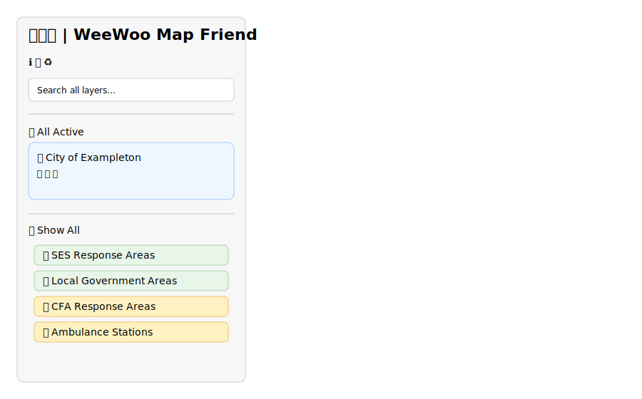

# WeeWoo Map Friend 📍🚨

An interactive emergency services mapping application for Victoria, Australia, featuring comprehensive responsive design, Progressive Web App capabilities, and native mobile app support.

🚀 **[Live Demo](https://goatindex.github.io/mapexp.github.io/)** | 📚 **[Documentation](#documentation)** | 🐛 **[Issues](https://github.com/goatindex/mapexp.github.io/issues)** | 📱 **[Mobile Apps](#native-mobile-apps)**

## Table of Contents

- [Features](#features)
- [Quick Start](#quick-start)
- [Native Mobile Apps](#native-mobile-apps)
- [Available Scripts](#available-scripts)
- [Deployment](#deployment)
- [Architecture](#architecture)
- [API Reference](#api-reference)
- [Performance](#performance)
- [Development](#development)
- [Security](#security)
- [Troubleshooting](#troubleshooting)
- [Contributing](#contributing)

## Features

### 📱 Multi-Platform Support
- **Responsive Web Design**: Mobile-first responsive design with 4-tier breakpoint system (480px/768px/1024px/1200px+)
- **Progressive Web App**: Installable PWA with offline support and native app behaviors
- **Native Mobile Apps**: iOS and Android app store deployment with Capacitor framework
- **Cross-Platform Compatibility**: Seamless experience across web browsers and native platforms

### 🗺️ Emergency Services Mapping
- **Interactive Map**: Leaflet.js-based mapping with emergency service boundaries
- **SES Response Areas**: State Emergency Service boundaries and unit locations
- **CFA Brigades**: Country Fire Authority response areas and station locations
- **Ambulance Stations**: Victoria Ambulance service points
- **Police Stations**: Victoria Police station locations
- **FRV Areas**: Fire Rescue Victoria coverage zones
- **LGA Boundaries**: Local Government Area boundaries

### 🎛️ Advanced Controls
- **Sidebar Controls**: Collapsible sections for each layer category with adaptive touch-friendly search
- **Active List Management**: "All Active" section with controls for:
  - 📢 Emphasise (highlight on map)
  - 🏷️ Show Name (display labels)
  - 🌦️ 7-day Weather (forecast integration)
- **Reset Functionality**: ♻️ button to return to default state
- **Documentation**: Built-in ℹ️ Info modal and 📚 Documentation drawer with responsive layout

### 📱 Native App Features
- **Enhanced Geolocation**: Native GPS access with high accuracy positioning
- **Haptic Feedback**: Touch feedback for interactions and notifications
- **Status Bar Control**: Platform-specific status bar styling and behavior
- **Background Processing**: Web Workers for heavy geometry calculations
- **Offline Capabilities**: Service Worker with multi-strategy caching
- **Native Back Button**: Android back button handling and navigation

### 🚀 Performance Optimized
- **Canvas Rendering**: High-performance polygon rendering
- **Async Operations**: Batched loading for bulk operations
- **Lazy Loading**: Progressive data loading for large datasets
- **Smart Caching**: Service Worker with cache-first, network-first, and stale-while-revalidate strategies
- **Web Workers**: Background processing for Turf.js geometry calculations
- **Z-index Management**: Proper layer ordering with custom panes

## Quick Start

### Local Development

1. **Clone and serve the project**:

   ```bash
   git clone https://github.com/goatindex/mapexp.github.io.git
   cd mapexp.github.io

   # Serve locally (choose one)
   python -m http.server 8000
   # OR
   npx serve .
   # OR
   php -S localhost:8000
   ```

2. **Open in browser**:
   ```
   http://127.0.0.1:8000
   ```

### One-Command Setup (Windows)

```powershell
# Starts backend + static server with automated checks
.\scripts\dev-up.ps1
```

## Native Mobile Apps

### 📱 App Store Deployment

WeeWoo Map Friend is ready for iOS App Store and Google Play Store deployment using Capacitor.

#### Prerequisites
- **Node.js** (v16 or later)
- **Xcode** (for iOS builds)
- **Android Studio** (for Android builds)

#### Quick Build for App Stores

```bash
# Install dependencies and build for app stores
npm install
npm run build:app
```

This will:
- Install all dependencies (including Capacitor)
- Generate app icons and assets
- Initialize iOS and Android projects
- Open Xcode and Android Studio for final builds

#### Development with Live Reload

```bash
# iOS development
npm run dev:ios

# Android development
npm run dev:android
```

#### Manual Platform Management

```bash
# Sync web changes to native platforms
npm run sync

# Open native projects
npm run open:ios       # Opens Xcode
npm run open:android   # Opens Android Studio
```

### 🔧 Native Features Available

- **Enhanced Geolocation**: Native GPS with high accuracy
- **Haptic Feedback**: Touch feedback for interactions
- **Status Bar Control**: Platform-specific styling
- **Background Processing**: Web Workers for performance
- **Offline Support**: Advanced caching strategies
- **Native Navigation**: Back button handling and app state management

### 📋 App Store Submission Checklist

#### iOS App Store
- [ ] Configure app signing in Xcode
- [ ] Set deployment target (iOS 13.0+)
- [ ] Add App Store metadata and screenshots
- [ ] Archive and upload to App Store Connect
- [ ] Submit for review

#### Google Play Store
- [ ] Generate signed APK/AAB in Android Studio
- [ ] Test on various Android devices
- [ ] Add Play Store metadata and screenshots
- [ ] Upload to Google Play Console
- [ ] Submit for review

## Available Scripts

| Command | Description |
|---------|-------------|
| `npm run dev` | Start local development servers |
| `npm run build:app` | Full app store build pipeline |
| `npm run sync` | Sync web changes to native platforms |
| `npm run dev:ios` | Live reload development for iOS |
| `npm run dev:android` | Live reload development for Android |
| `npm run open:ios` | Open iOS project in Xcode |
| `npm run open:android` | Open Android project in Studio |
| `npm run capture` | Generate screenshots for documentation |

## Deployment

### GitHub Pages (Recommended)

1. **Enable GitHub Pages** in repository settings
2. **Set source** to "Deploy from a branch" → `main` branch
3. **Access at**: `https://yourusername.github.io/mapexp.github.io/`

### Static Hosting

Works with any static host (Netlify, Vercel, Apache, Nginx):

```bash
# Build artifacts (if needed)
npm install  # for screenshot tooling only
npm run capture  # optional: generate fresh screenshots

# Deploy entire directory to your static host
```

### Docker Deployment

```dockerfile
# Dockerfile
FROM nginx:alpine
COPY . /usr/share/nginx/html
EXPOSE 80
```

```bash
docker build -t weewoo-map .
docker run -p 8080:80 weewoo-map
```

### Production Considerations

- **Backend**: Deploy Flask backend for weather features
- **Environment**: Set `USE_MOCK=0` and configure API keys
- **HTTPS**: Enable HTTPS for production (required for geolocation and PWA features)
- **CSP**: Configure Content Security Policy headers
- **Caching**: Set appropriate cache headers for GeoJSON files
- **PWA**: Service worker provides offline support and improved performance
- **App Store**: Ready for mobile app store deployment via Capacitor or Cordova

## Architecture

### Entry Points & Data Flow

```
index.html → PWA manifest & service worker → js/bootstrap.js → device.js (context) → preloader.js → loaders/*.js → UI components
                                                            ↓
                                                        state.js (centralized state)
                                                            ↓
                                                        config.js (styling/metadata)
```

### Key Components

- **Entry point**: `js/bootstrap.js` — map initialization, panes, collapsibles, device integration
- **Device Context**: `js/device.js` — comprehensive device detection, platform optimization, native app behaviors
- **PWA Support**: `sw.js` — service worker for offline support and performance caching
- **State management**: `js/state.js` — shared maps for layers, names, emphasis, labels
- **Configuration**: `js/config.js` — styles, category metadata, colors, responsive breakpoints
- **Data loaders**: `js/loaders/*.js` — fetch/parse GeoJSON and create sidebar rows
- **UI components**: `js/ui/*.js` — "All Active" management, collapsible behavior, responsive search
- **Utilities**: `js/utils/*.js` — DOM helpers, coordinate conversion, error handling, responsive utilities

### Event Flow

1. **Data Loading**: Loader builds sidebar rows
2. **User Interaction**: User checks/unchecks items
3. **State Update**: Change handler adds/removes layers, labels, emphasis
4. **UI Sync**: `updateActiveList()` rebuilds "All Active" section

## API Reference

### Backend Endpoints

#### Health Check

```http
GET /health
```

**Response**: `200 OK`

```json
{ "status": "ok" }
```

#### Weather Data

```http
GET /api/weather?lat={latitude}&lon={longitude}&days={days}&provider={provider}
```

**Parameters**:

- `lat` (required): Latitude (-90 to 90)
- `lon` (required): Longitude (-180 to 180)
- `days` (optional): Number of forecast days (1-7, default: 7)
- `provider` (optional): Weather provider (`mock`, `open-meteo`, `willyweather`)

**Response**: `200 OK`

```json
{
  "location": { "lat": -37.8136, "lon": 144.9631 },
  "days": 7,
  "forecast": [
    {
      "day": 1,
      "summary": "Partly cloudy",
      "tempMin": 12,
      "tempMax": 22
    }
  ]
}
```

**Error Responses**:

- `400 Bad Request`: Invalid parameters
- `404 Not Found`: No location found for coordinates
- `502 Bad Gateway`: Upstream API error
- `504 Gateway Timeout`: Request timeout

### Frontend Configuration

#### Category Metadata

```javascript
window.categoryMeta = {
  ses: {
    type: 'polygon',
    nameProp: 'RESPONSE_ZONE_NAME',
    styleFn: sesStyle,
    defaultOn: () => false,
    listId: 'sesList',
    toggleAllId: 'toggleAllSES',
  },
  // ... other categories
};
```

#### Color Configuration

```javascript
window.outlineColors = {
  ses: '#cc7a00',
  lga: 'black',
  cfa: '#FF0000',
  // ... other categories
};
```

## Performance

### PWA & Service Worker Caching

Comprehensive caching strategy for optimal performance and offline support:

```javascript
// Cache strategies
- Static assets: Cache-first (HTML, CSS, JS, manifest)
- Data files: Stale-while-revalidate (GeoJSON, JSON data)
- Dynamic content: Network-first with cache fallback
- External resources: Cached with graceful degradation
```

**Features**:

- **Offline Support**: Core functionality available without internet connection
- **Background Updates**: Data refreshed automatically when connection available
- **Install Prompt**: Native "Add to Home Screen" functionality
- **Update Notifications**: Automatic prompts when new versions available
- **Performance Boost**: 60-90% faster loading after initial visit

### Responsive Design System

Mobile-first responsive architecture with CSS custom properties:

```css
/* 4-tier breakpoint system */
--mobile-small: 480px    /* Small phones */
--mobile-large: 768px    /* Large phones/small tablets */
--tablet: 1024px         /* Tablets */
--desktop: 1200px        /* Desktop and up */
```

**Features**:

- **Adaptive Touch Targets**: 44px minimum on touch devices, 34px on desktop
- **Device-Specific Optimizations**: iOS/Android/Windows platform adaptations
- **Orientation Handling**: Dynamic layout adjustments for landscape/portrait
- **Safe Area Support**: Proper handling of notched devices and PWA modes

### Async Batching for Bulk Operations

Large dataset handling uses async batching to prevent UI freezing:

```javascript
// Example: Processing 1000+ CFA areas
const batchSize = 20;
for (let i = 0; i < items.length; i += batchSize) {
  const batch = items.slice(i, i + batchSize);
  // Process batch
  await new Promise((resolve) => requestAnimationFrame(resolve));
}
```

**Features**:

- **Batch processing**: 20 items per animation frame
- **Progress feedback**: Loading indicators with progress counts
- **Responsive UI**: Uses `requestAnimationFrame` for smooth operation
- **Optimistic updates**: Immediate visual feedback

### Other Optimizations

- **Modular preloading**: Data loads in sidebar order (SES → LGA → CFA → Ambulance)
- **Canvas rendering**: Polygons use Leaflet canvas renderer for better performance
- **Lazy loading**: Police data only loads when section is expanded or toggled
- **Z-index panes**: Proper layer ordering without expensive bring-to-front operations
- **Deferred label creation**: Labels created in batches during bulk operations
- **Device Context Caching**: Responsive breakpoints cached to avoid repeated calculations

## Development

### Prerequisites

- Python 3.8+ (for backend)
- Node.js 16+ (for screenshot tooling, optional)
- Modern web browser

### Backend Setup (Optional - for weather features)

```powershell
# Create virtual environment
python -m venv .venv
.\.venv\Scripts\Activate.ps1

# Install dependencies
pip install -r backend\requirements.txt

# Configure environment
Copy-Item backend\.env.example backend\.env
# Edit backend\.env with your API keys

# Start backend
python backend/app.py
```

### Environment Variables

Create `backend/.env` from `backend/.env.example`:

```bash
# Required for WillyWeather provider
WILLYWEATHER_API_KEY=your_api_key_here

# CORS configuration
ALLOWED_ORIGINS=http://localhost:8000,http://127.0.0.1:8000

# Provider settings
USE_MOCK=1                    # Set to 0 for production
WEATHER_PROVIDER=mock         # mock, open-meteo, willyweather
CACHE_TTL_SECONDS=300
REQUEST_TIMEOUT=5
```

### Code Style & Quality

```bash
# Install linting tools (optional)
npm install -g eslint prettier

# Run linting
eslint js/**/*.js
prettier --check js/**/*.js

# Run preflights
python scripts/preflight_check_duplicates.py js
python scripts/preflight_active_collapsible.py
python scripts/preflight_reset_button.py
```

### Adding New Categories

1. **Add GeoJSON file** to project root
2. **Update `js/config.js`**:
   ```javascript
   window.categoryMeta.newcategory = {
     type: 'polygon',
     nameProp: 'NAME_FIELD',
     styleFn: newCategoryStyle,
     defaultOn: () => false,
     listId: 'newCategoryList',
     toggleAllId: 'toggleAllNewCategory',
   };
   ```
3. **Add HTML elements** to `index.html`
4. **Create loader** in `js/loaders/`
5. **Update state arrays** in `js/state.js`

## Security

### Current Security Measures

- **API Key Protection**: Backend proxy prevents frontend API key exposure
- **Input Sanitization**: Markdown docs sanitized with DOMPurify
- **CORS Configuration**: Restricted origins in backend
- **HTTPS CDNs**: External dependencies loaded over HTTPS

### Security Checklist

- [x] **API Keys**: API keys secured in backend (no frontend exposure)
- [x] **PWA Security**: Service worker implements secure caching strategies
- [ ] **CSP Headers**: Configure Content Security Policy for production
- [x] **HTTPS**: HTTPS required for PWA features and service worker
- [ ] **Input Validation**: Validate all user inputs (coordinates, search terms)
- [x] **Dependency Security**: Dependencies loaded from trusted CDNs
- [x] **Environment Variables**: Sensitive config via environment variables
- [x] **Safe Areas**: Proper handling of device safe areas and notches

### Reporting Security Issues

Please report security vulnerabilities privately via GitHub Security Advisories or email.

## Troubleshooting

### Common Issues

#### Map doesn't load

**Symptoms**: Blank page or "Map not initialized" error

**Solutions**:

1. Check browser console for JavaScript errors
2. Verify all script dependencies are loading
3. Ensure you're serving over HTTP/HTTPS (not file://)
4. Check network connectivity for tile loading

#### Sidebar controls don't work

**Symptoms**: Checkboxes don't respond, sections don't expand

**Solutions**:

1. Check for duplicate HTML IDs in browser inspector
2. Verify event listeners are attached (check `bootstrap.js`)
3. Look for JavaScript errors in console
4. Try the reset button (♻️) to restore default state

#### Weather features not working

**Symptoms**: No weather data, 7-day forecast empty

**Solutions**:

1. Verify backend is running on http://127.0.0.1:5000
2. Check backend logs for API errors
3. Confirm `backend/.env` has correct API keys
4. Test backend directly: `curl http://127.0.0.1:5000/health`

#### Performance issues with large datasets

**Symptoms**: Browser freezing when toggling "Show All"

**Solutions**:

1. Performance is optimized for batching - if issues persist, check:
2. Available browser memory
3. Disable browser extensions that might interfere
4. Use Chrome's Performance tab to identify bottlenecks

#### Data not loading

**Symptoms**: Categories show "No items" or empty lists

**Solutions**:

1. Check network tab for failed GeoJSON requests
2. Verify GeoJSON files exist and are valid
3. Check CORS if serving from different domain
4. Inspect browser console for parsing errors

#### Layout broken/everything appears very small

**Symptoms**: Map and sidebar appear tiny, layout completely broken, content overlapping

**Solutions**:

1. **Check the viewport meta tag** in `index.html` - this is the most common cause
2. Look for corrupted HTML structure in the `<head>` section
3. Verify no content has been accidentally inserted into meta tags
4. Common fix: Ensure viewport tag reads: `<meta name="viewport" content="width=device-width, initial-scale=1,user-scalable=no" />`
5. If layout still broken, check browser console for CSS loading errors

**Important**: Before assuming the entire file is corrupted, check for small targeted issues first. Often what appears as "corruption" is actually a single malformed tag or misplaced content that can be fixed with a minimal edit.

### Debug Mode

Enable debug logging:

```javascript
// In browser console
localStorage.setItem('debug', '1');
// Reload page to see detailed logs
```

### Performance Monitoring

Monitor performance:

```javascript
// Check current active items
console.log(
  'Active items:',
  Object.keys(window.featureLayers).map((cat) => Object.keys(window.featureLayers[cat]).length)
);

// Check pending labels
console.log('Pending labels:', window.pendingLabels.length);
```

## Contributing

### Getting Started

1. **Fork the repository** on GitHub
2. **Create a feature branch**: `git checkout -b feature/your-feature`
3. **Make your changes** following the code style guidelines
4. **Test your changes** locally
5. **Run preflights**: `python scripts/preflight_*.py`
6. **Submit a pull request** with clear description

### Code Style Guidelines

- **JavaScript**: Use ES6+ syntax, prefer named exports
- **Comments**: Include JSDoc for functions, explain complex logic
- **Naming**: Use camelCase for variables, PascalCase for classes
- **Modularity**: Keep functions small and focused
- **Error Handling**: Always handle errors gracefully

### Pull Request Process

1. **Update documentation** if changing functionality
2. **Add tests** for new features (if applicable)
3. **Ensure all preflights pass**
4. **Update README** if adding new dependencies or setup steps
5. **Link to relevant issues** in PR description

### Architecture Guidelines

- **State Management**: Use `state.js` for shared state, avoid tight coupling
- **Configuration**: Add new settings to `config.js`
- **UI Components**: Keep UI logic in `js/ui/` directory
- **Data Loading**: Create loaders in `js/loaders/` with consistent patterns
- **Error Handling**: Use `js/utils/errorUI.js` for user-facing errors

### Future Roadmap

#### High Priority

- **ES Module Migration**: Convert from window globals to proper ES modules
- **TypeScript Adoption**: Add type safety for better development experience
- **Testing Framework**: Add unit and integration tests
- **Performance**: Web Workers for heavy geometry processing

#### Medium Priority

- **Advanced Search**: Filter by distance, overlap, custom criteria
- **Real-time Data**: Live emergency alerts and traffic integration
- **Capacitor Integration**: Native mobile app deployment to iOS/Android app stores
- **Push Notifications**: Emergency alerts and updates via service worker

#### Low Priority

- **Plugin Architecture**: Extensible system for custom data sources
- **Export/Import**: Save and share custom map configurations
- **Analytics**: Usage tracking and performance monitoring
- **Internationalization**: Multi-language support

#### Completed ✅

- **Mobile Optimization**: ✅ Responsive design and touch interactions (Phase 1 & 2)
- **Offline Support**: ✅ Service Worker for offline map viewing (Phase 2)
- **PWA Features**: ✅ Progressive Web App with install capability (Phase 2)

For questions or discussion, open an issue or start a discussion on GitHub.

## Documentation

### Built-in Documentation

The application includes comprehensive built-in documentation:

- **ℹ️ Info Modal**: Quick overview and tips
- **📚 Documentation Drawer**: Full documentation with navigation
- **Deep Links**: Direct links to specific docs sections

### Documentation Structure

- `docs/intro.md` - Welcome and getting started
- `docs/usage.md` - How to use the application
- `docs/layers.md` - Layer categories and data sources

### Adding Documentation

1. Create new `.md` file in `docs/` directory
2. Add link in TOC inside `index.html`
3. Documentation is automatically rendered with Marked.js and sanitized

## Screenshots




### Automated Screenshots

Generate fresh screenshots (requires Node.js):

```powershell
# In one terminal: serve the site
python -m http.server 8000

# In another terminal: capture screenshots
npm install
npm run capture
```

## License

This project is open source. See individual files for specific licensing terms.

## Acknowledgments

- **Leaflet.js** for the mapping library
- **OpenStreetMap** for base map tiles
- **Victoria State Government** for emergency services data
- **Contributors** who have helped improve this project
