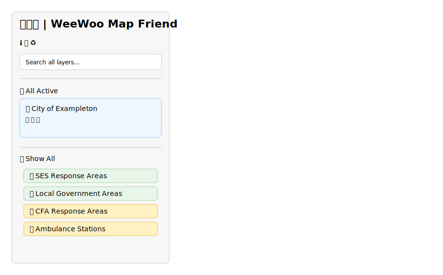
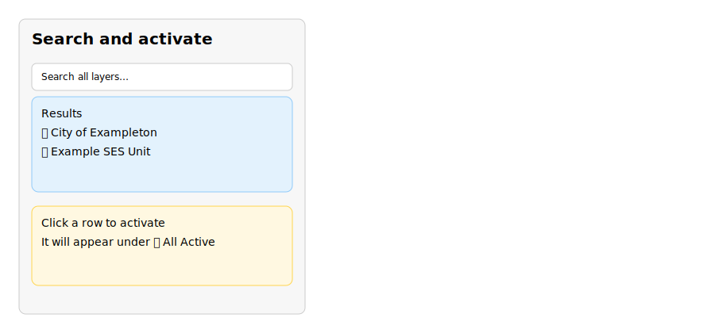

# WeeWoo Map Friend 📍🚨

An interactive emergency services mapping application for Victoria, Australia, featuring comprehensive responsive design, Progressive Web App capabilities, and native mobile app support.

🚀 **[Live Demo](https://goatindex.github.io/mapexp.github.io/)** | 📚 **[Documentation](#documentation)** | 🐛 **[Issues](https://github.com/goatindex/mapexp.github.io/issues)** | 📱 **[Mobile Apps](#native-mobile-apps)**

## Table of Contents

- [Features](#features)
- [Quick Start](#quick-start)
- [Documentation](#documentation)
- [Native Mobile Apps](#native-mobile-apps)
- [Available Scripts](#available-scripts)
- [Contributing](#contributing)

## Features

### 📱 Multi-Platform Support

- **Responsive Web Design**: Mobile-first responsive design with 4-tier breakpoint system
- **Progressive Web App**: Installable PWA with offline support and native app behaviors
- **Native Mobile Apps**: iOS and Android app store deployment with Capacitor framework
- **Cross-Platform Compatibility**: Seamless experience across web browsers and native platforms

### 🗺️ Emergency Services Mapping

- **Interactive Map**: Leaflet.js-based mapping with emergency service boundaries
- **SES Response Areas**: State Emergency Service boundaries and unit locations
- **CFA Brigades**: Country Fire Authority response areas and station locations
- **Ambulance Stations**: Victoria Ambulance service points
- **Police Stations**: Victoria Police station locations
- **FRV Areas**: Fire Rescue Victoria coverage zones
- **LGA Boundaries**: Local Government Area boundaries

### 🎛️ Advanced Controls

- **Sidebar Controls**: Collapsible sections for each layer category with adaptive touch-friendly search
- **Active List Management**: "All Active" section with controls for emphasise, labels, and weather
- **Reset Functionality**: ♻️ button to return to default state
- **Documentation**: Built-in ℹ️ Info modal and 📚 Documentation drawer with responsive layout

### 🚀 Performance Optimized

- **ES6 Module System**: Modern JavaScript architecture with optimized module loading
- **Canvas Rendering**: High-performance polygon rendering
- **Async Operations**: Batched loading for bulk operations
- **Smart Caching**: Service Worker with multiple caching strategies
- **Web Workers**: Background processing for geometry calculations
- **Offline Support**: Core functionality available without internet connection

## Quick Start

### Local Development

1. **Clone and serve the project**:

   ```bash
   git clone https://github.com/goatindex/mapexp.github.io.git
   cd mapexp.github.io

   # Serve locally (choose one)
   python -m http.server 8000
   # OR
   npx serve .
   # OR
   php -S localhost:8000
   ```

2. **Open in browser**:
   ```
   http://127.0.0.1:8000
   ```

### One-Command Setup (Windows)

```powershell
# Starts backend + static server with automated checks
.\scripts\dev-up.ps1
```

### Backend Setup (Optional - for weather features)

```powershell
# Create virtual environment
python -m venv .venv
.\.venv\Scripts\Activate.ps1

# Install dependencies
pip install -r backend\requirements.txt

# Configure environment
Copy-Item backend\.env.example backend\.env
# Edit backend\.env with your API keys

# Start backend
python backend/app.py
```

## 📚 Documentation

### Comprehensive Project Documentation

**All detailed documentation is now available in the `project_docs/` directory:**

- **[Project Documentation Hub](project_docs/README.md)** - Complete project overview and navigation
- **[Architecture Documentation](project_docs/architecture/)** - Modern ES6 system design, components, and data flow
- **[Development Guides](project_docs/development/)** - Setup, workflows, and testing framework
- **[API Reference](project_docs/api/)** - Backend endpoints, frontend configuration, and integrations
- **[Deployment Guides](project_docs/deployment/)** - Environment setup, procedures, and operations
- **[Performance Baselines](project_docs/performance/)** - Performance metrics and optimization

**✅ Current System State: Modern ES6 Architecture**
The project has successfully completed its migration to modern ES6 modules with comprehensive state management, event-driven communication, and modular architecture. The system now operates on a fully modern JavaScript foundation with minimal legacy compatibility layers.

**📚 Documentation Status: Modern Architecture Documentation**
Project documentation reflects the completed ES6 migration, providing guidance for working with the modern modular architecture.

### Application Documentation

- **[User Documentation](in_app_docs/)** - User-facing features, usage guides, and troubleshooting
- **[Quick Start Guide](project_docs/getting-started/quick-start.md)** - Get up and running quickly

### Quick Navigation

- **Getting Started**: [Quick Start Guide](project_docs/getting-started/quick-start.md)
- **Architecture**: [System Overview](project_docs/architecture/overview.md)
- **Development**: [Developer Setup](project_docs/development/setup.md)
- **Testing**: [Testing Framework](project_docs/development/testing.md)

## Native Mobile Apps

### 📱 App Store Deployment

WeeWoo Map Friend is ready for iOS App Store and Google Play Store deployment using Capacitor.

#### Prerequisites

- **Node.js** (v16 or later)
- **Xcode** (for iOS builds)
- **Android Studio** (for Android builds)

#### Quick Build for App Stores

```bash
# Install dependencies and build for app stores
npm install
npm run build:app
```

This will:

- Install all dependencies (including Capacitor)
- Generate app icons and assets
- Initialize iOS and Android projects
- Open Xcode and Android Studio for final builds

#### Development with Live Reload

```bash
# iOS development
npm run dev:ios

# Android development
npm run dev:android
```

#### Manual Platform Management

```bash
# Sync web changes to native platforms
npm run sync

# Open native projects
npm run open:ios       # Opens Xcode
npm run open:android   # Opens Android Studio
```

### 🔧 Native Features Available

- **Enhanced Geolocation**: Native GPS with high accuracy
- **Haptic Feedback**: Touch feedback for interactions
- **Status Bar Control**: Platform-specific styling
- **Background Processing**: Web Workers for performance
- **Offline Support**: Advanced caching strategies
- **Native Navigation**: Back button handling and app state management

## Available Scripts

| Command                | Description                            |
| ---------------------- | -------------------------------------- |
| `npm run dev`          | Start local development servers        |
| `npm run build:app`    | Full app store build pipeline          |
| `npm run sync`         | Sync web changes to native platforms   |
| `npm run dev:ios`      | Live reload development for iOS        |
| `npm run dev:android`  | Live reload development for Android    |
| `npm run open:ios`     | Open iOS project in Xcode              |
| `npm run open:android` | Open Android project in Studio         |
| `npm run capture`      | Generate screenshots for documentation |

## Contributing

### Getting Started

1. **Fork the repository** on GitHub
2. **Create a feature branch**: `git checkout -b feature/your-feature`
3. **Make your changes** following the code style guidelines
4. **Test your changes** locally
5. **Run preflights**: `python scripts/preflight_*.py`
6. **Submit a pull request** with clear description

### Code Style Guidelines

- **JavaScript**: Use ES6+ syntax, prefer named exports
- **Comments**: Include JSDoc for functions, explain complex logic
- **Naming**: Use camelCase for variables, PascalCase for classes
- **Modularity**: Keep functions small and focused
- **Error Handling**: Always handle errors gracefully

### Architecture Guidelines

- **State Management**: Use `StateManager` for shared state with reactive updates
- **Configuration**: Add new settings to `ConfigurationManager`
- **UI Components**: Use ES6 modules in `js/modules/` directory
- **Data Loading**: Use modern loaders like `PolygonLoader` with consistent patterns
- **Error Handling**: Use `ErrorUI` module for user-facing errors

### Future Roadmap

#### High Priority

- **TypeScript Adoption**: Add type safety for better development experience
- **Testing Framework**: Add unit and integration tests
- **Performance**: Web Workers for heavy geometry processing
- **Documentation Modernization**: Update all documentation to reflect modern architecture

#### Medium Priority

- **Advanced Search**: Filter by distance, overlap, custom criteria
- **Real-time Data**: Live emergency alerts and traffic integration
- **Capacitor Integration**: Native mobile app deployment to iOS/Android app stores
- **Push Notifications**: Emergency alerts and updates via service worker

#### Completed ✅

- **ES Module Migration**: ✅ Complete conversion to modern ES6 modules with state management
- **Mobile Optimization**: ✅ Responsive design and touch interactions
- **Offline Support**: ✅ Service Worker for offline map viewing
- **PWA Features**: ✅ Progressive Web App with install capability
- **FAB Framework**: ✅ Unified Floating Action Button system
- **Code Modernization**: ✅ ES6 modules, component architecture, CSS custom properties

For detailed development information, architecture analysis, and technical specifications, see the **[Project Documentation](project_docs/README.md)**.

## Screenshots





### Automated Screenshots

Generate fresh screenshots (requires Node.js):

```powershell
# In one terminal: serve the site
python -m http.server 8000

# In another terminal: capture screenshots
npm install
npm run capture
```

## License

This project is open source. See individual files for specific licensing terms.

## Acknowledgments

- **Leaflet.js** for the mapping library
- **OpenStreetMap** for base map tiles
- **Victoria State Government** for emergency services data
- **Contributors** who have helped improve this project

---

**For comprehensive technical documentation, development guides, and architecture details, visit the [Project Documentation Hub](project_docs/README.md).**
