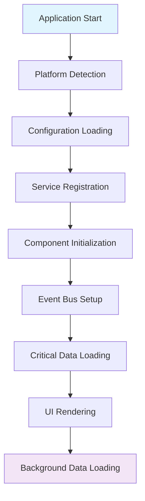
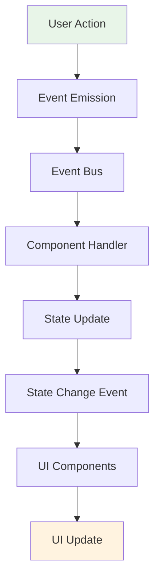
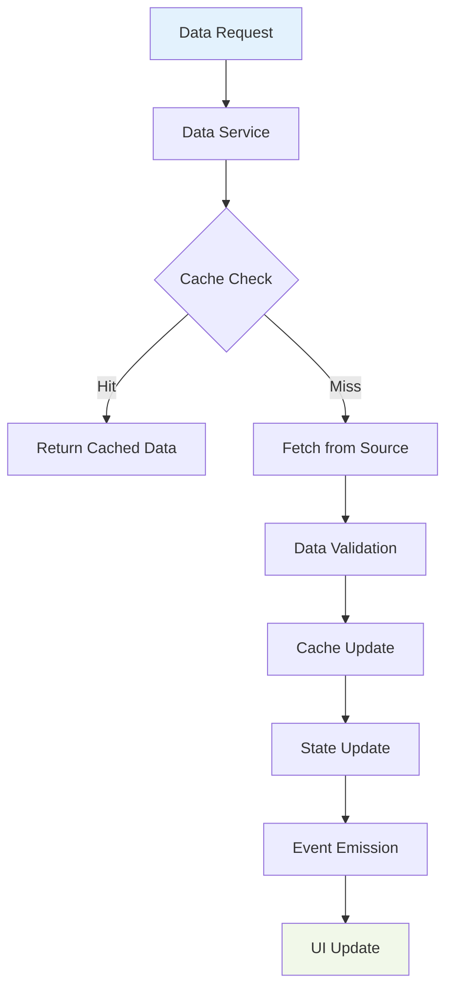
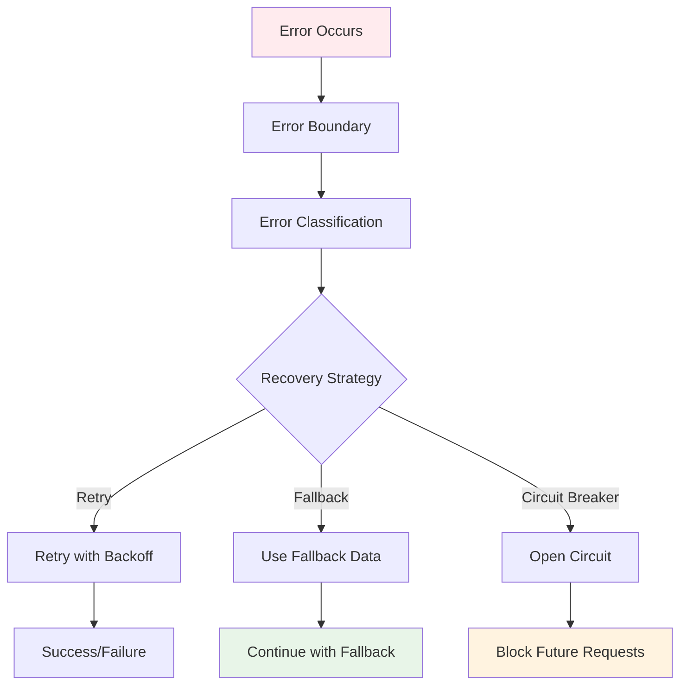

# Data Flow Architecture

## Overview

This document describes the data flow patterns and state management architecture for the refactored WeeWoo Map Friend system. The architecture implements a unidirectional data flow with event-driven communication and resilient error handling.

## Core Data Flow Principles

### 1. Unidirectional Data Flow
Data flows in one direction: **Actions → State Updates → UI Updates**

```
User Action → Event → State Update → UI Re-render
```

### 2. Event-Driven Communication
Components communicate via events, not direct method calls:

```
Component A → Event Bus → Component B
```

### 3. Immutable State Updates
State is never mutated directly; new state objects are created:

```
Current State + Action = New State
```

### 4. Single Source of Truth
All application state is managed centrally:

```
StateManager → All Components
```

## Data Flow Patterns

### 1. Initialization Flow



**Description**: The application initializes in a specific order to ensure dependencies are available when needed.

### 2. User Interaction Flow



**Description**: User interactions trigger events that flow through the system to update state and UI.

### 3. Data Loading Flow



**Description**: Data loading follows a cache-first strategy with validation and error handling.

### 4. Error Handling Flow



**Description**: Errors are caught, classified, and handled with appropriate recovery strategies.

## State Management Architecture

### 1. State Structure

```typescript
interface ApplicationState {
  // Map state
  map: {
    center: [number, number];
    zoom: number;
    layers: Map<string, LayerState>;
    selectedFeatures: string[];
    viewport: ViewportState;
  };
  
  // Sidebar state
  sidebar: {
    expandedSections: string[];
    selectedItems: Map<string, string[]>;
    searchQuery: string;
    filterOptions: FilterOptions;
  };
  
  // Data state
  data: {
    categories: Map<string, CategoryState>;
    loading: Map<string, boolean>;
    errors: Map<string, ErrorState>;
    lastUpdated: Map<string, number>;
  };
  
  // UI state
  ui: {
    theme: 'light' | 'dark';
    language: string;
    notifications: Notification[];
    modals: ModalState[];
  };
  
  // Platform state
  platform: {
    type: 'web' | 'mobile' | 'desktop';
    capabilities: PlatformCapabilities;
    connectivity: ConnectivityState;
  };
}
```

### 2. Redux Toolkit State Updates

```typescript
import { createSlice, PayloadAction } from '@reduxjs/toolkit';

// Map slice
const mapSlice = createSlice({
  name: 'map',
  initialState: {
    center: [0, 0] as [number, number],
    zoom: 10,
    layers: new Map<string, LayerState>(),
    selectedFeatures: [] as string[],
    viewport: { width: 0, height: 0 }
  },
  reducers: {
    setCenter: (state, action: PayloadAction<[number, number]>) => {
      state.center = action.payload;
    },
    setZoom: (state, action: PayloadAction<number>) => {
      state.zoom = action.payload;
    },
    addLayer: (state, action: PayloadAction<{ id: string; layer: LayerState }>) => {
      state.layers.set(action.payload.id, action.payload.layer);
    },
    removeLayer: (state, action: PayloadAction<string>) => {
      state.layers.delete(action.payload);
    }
  }
});

// Sidebar slice
const sidebarSlice = createSlice({
  name: 'sidebar',
  initialState: {
    expandedSections: [] as string[],
    selectedItems: new Map<string, string[]>(),
    searchQuery: '',
    filterOptions: {}
  },
  reducers: {
    toggleSection: (state, action: PayloadAction<string>) => {
      const sectionId = action.payload;
      const index = state.expandedSections.indexOf(sectionId);
      if (index > -1) {
        state.expandedSections.splice(index, 1);
      } else {
        state.expandedSections.push(sectionId);
      }
    },
    setSearchQuery: (state, action: PayloadAction<string>) => {
      state.searchQuery = action.payload;
    }
  }
});

// Data slice
const dataSlice = createSlice({
  name: 'data',
  initialState: {
    categories: new Map<string, CategoryState>(),
    loading: new Map<string, boolean>(),
    errors: new Map<string, ErrorState>(),
    lastUpdated: new Map<string, number>()
  },
  reducers: {
    setLoading: (state, action: PayloadAction<{ category: string; loading: boolean }>) => {
      state.loading.set(action.payload.category, action.payload.loading);
    },
    setError: (state, action: PayloadAction<{ category: string; error: ErrorState }>) => {
      state.errors.set(action.payload.category, action.payload.error);
    }
  }
});
```

### 3. State Subscriptions

```typescript
class StateManager {
  private state: ApplicationState;
  private subscribers: Map<string, StateListener[]>;
  
  subscribe(path: string, listener: StateListener): () => void {
    if (!this.subscribers.has(path)) {
      this.subscribers.set(path, []);
    }
    
    this.subscribers.get(path)!.push(listener);
    
    // Return unsubscribe function
    return () => {
      const listeners = this.subscribers.get(path);
      if (listeners) {
        const index = listeners.indexOf(listener);
        if (index > -1) {
          listeners.splice(index, 1);
        }
      }
    };
  }
  
  private notifySubscribers(path: string, newState: any): void {
    const listeners = this.subscribers.get(path);
    if (listeners) {
      listeners.forEach(listener => {
        try {
          listener(newState);
        } catch (error) {
          this.handleSubscriptionError(error, path, listener);
        }
      });
    }
  }
}
```

## Event System Architecture

### 1. Event Types

```typescript
// Base event interface
interface Event<T = any> {
  type: string;
  payload: T;
  timestamp: number;
  source: string;
  id: string;
}

// Specific event types
interface MapDataLoadedEvent extends Event<{
  category: string;
  features: GeoJSON.Feature[];
  metadata: DataMetadata;
}> {
  type: 'map.data.loaded';
}

interface SidebarItemSelectedEvent extends Event<{
  category: string;
  itemId: string;
  selected: boolean;
}> {
  type: 'sidebar.item.selected';
}

interface SearchQueryChangedEvent extends Event<{
  query: string;
  results: SearchResult[];
}> {
  type: 'search.query.changed';
}
```

### 2. Event Bus Implementation

```typescript
class EventBus {
  private handlers: Map<string, EventHandler[]>;
  private middleware: EventMiddleware[];
  
  emit<T>(event: Event<T>): void {
    // Apply middleware
    const processedEvent = this.applyMiddleware(event);
    
    // Get handlers for event type
    const handlers = this.handlers.get(event.type) || [];
    
    // Execute handlers
    handlers.forEach(handler => {
      try {
        handler(processedEvent);
      } catch (error) {
        this.handleHandlerError(error, event, handler);
      }
    });
  }
  
  on<T>(eventType: string, handler: EventHandler<T>): () => void {
    if (!this.handlers.has(eventType)) {
      this.handlers.set(eventType, []);
    }
    
    this.handlers.get(eventType)!.push(handler);
    
    // Return unsubscribe function
    return () => {
      const handlers = this.handlers.get(eventType);
      if (handlers) {
        const index = handlers.indexOf(handler);
        if (index > -1) {
          handlers.splice(index, 1);
        }
      }
    };
  }
  
  private applyMiddleware<T>(event: Event<T>): Event<T> {
    return this.middleware.reduce((processedEvent, middleware) => {
      return middleware(processedEvent);
    }, event);
  }
}
```

### 3. Event Middleware

```typescript
// Logging middleware
const loggingMiddleware: EventMiddleware = (event) => {
  console.log(`Event: ${event.type}`, event.payload);
  return event;
};

// Error handling middleware
const errorHandlingMiddleware: EventMiddleware = (event) => {
  try {
    return event;
  } catch (error) {
    console.error('Event processing error:', error);
    return {
      ...event,
      type: 'error.event.processing.failed',
      payload: { error: error.message, originalEvent: event }
    };
  }
};

// Performance monitoring middleware
const performanceMiddleware: EventMiddleware = (event) => {
  const startTime = performance.now();
  
  // Add performance metadata
  return {
    ...event,
    meta: {
      ...event.meta,
      performance: {
        startTime,
        duration: 0
      }
    }
  };
};
```

## Data Service Architecture

### 1. Data Service Interface

```typescript
interface DataService {
  loadData(category: string): Promise<GeoJSON.Feature[]>;
  loadDataBatch(categories: string[]): Promise<Map<string, GeoJSON.Feature[]>>;
  getCachedData(category: string): GeoJSON.Feature[] | null;
  invalidateCache(category: string): void;
  subscribeToDataUpdates(category: string, callback: DataUpdateCallback): () => void;
}
```

### 2. Data Loading Strategy

```typescript
class DataService {
  private cache: Map<string, CachedData>;
  private loadingPromises: Map<string, Promise<GeoJSON.Feature[]>>;
  private circuitBreaker: CircuitBreaker;
  
  async loadData(category: string): Promise<GeoJSON.Feature[]> {
    // Check cache first
    const cached = this.getCachedData(category);
    if (cached && !this.isExpired(cached)) {
      return cached.data;
    }
    
    // Check if already loading
    const existingPromise = this.loadingPromises.get(category);
    if (existingPromise) {
      return existingPromise;
    }
    
    // Load data with circuit breaker
    const promise = this.circuitBreaker.execute(async () => {
      const data = await this.fetchFromSource(category);
      this.cacheData(category, data);
      return data;
    });
    
    this.loadingPromises.set(category, promise);
    
    try {
      const result = await promise;
      return result;
    } finally {
      this.loadingPromises.delete(category);
    }
  }
  
  private async fetchFromSource(category: string): Promise<GeoJSON.Feature[]> {
    const url = this.configService.getDataUrl(category);
    const response = await fetch(url);
    
    if (!response.ok) {
      throw new Error(`Failed to load data for ${category}: ${response.statusText}`);
    }
    
    const data = await response.json();
    return this.validateData(data, category);
  }
}
```

### 3. Data Validation

```typescript
class DataValidator {
  validateGeoJSON(data: any): GeoJSON.Feature[] {
    if (!data || typeof data !== 'object') {
      throw new Error('Invalid data: not an object');
    }
    
    if (data.type !== 'FeatureCollection') {
      throw new Error('Invalid GeoJSON: not a FeatureCollection');
    }
    
    if (!Array.isArray(data.features)) {
      throw new Error('Invalid GeoJSON: features is not an array');
    }
    
    return data.features.map((feature, index) => {
      return this.validateFeature(feature, index);
    });
  }
  
  private validateFeature(feature: any, index: number): GeoJSON.Feature {
    if (!feature || typeof feature !== 'object') {
      throw new Error(`Invalid feature at index ${index}: not an object`);
    }
    
    if (feature.type !== 'Feature') {
      throw new Error(`Invalid feature at index ${index}: not a Feature`);
    }
    
    if (!feature.geometry || !feature.properties) {
      throw new Error(`Invalid feature at index ${index}: missing geometry or properties`);
    }
    
    return feature;
  }
}
```

## Component Communication Patterns

### 1. Map-Sidebar Communication

```typescript
// Map Manager
class MapManager {
  constructor(
    private eventBus: EventBus,
    private stateManager: StateManager
  ) {
    // Listen for sidebar selections
    this.eventBus.on('sidebar.item.selected', (event) => {
      this.handleSidebarSelection(event.payload);
    });
  }
  
  private handleSidebarSelection(payload: SidebarSelectionPayload): void {
    if (payload.selected) {
      this.addLayer(payload.category, payload.itemId);
    } else {
      this.removeLayer(payload.category, payload.itemId);
    }
  }
  
  private addLayer(category: string, itemId: string): void {
    // Add layer to map
    const layer = this.createLayer(category, itemId);
    this.map.addLayer(layer);
    
    // Emit event for other components
    this.eventBus.emit('map.layer.added', {
      category,
      itemId,
      layer
    });
  }
}

// Sidebar Manager
class SidebarManager {
  constructor(
    private eventBus: EventBus,
    private stateManager: StateManager
  ) {
    // Listen for map changes
    this.eventBus.on('map.layer.added', (event) => {
      this.updateSidebarState(event.payload);
    });
  }
  
  private updateSidebarState(payload: MapLayerAddedPayload): void {
    // Update sidebar UI to reflect map state
    this.updateItemSelection(payload.category, payload.itemId, true);
  }
}
```

### 2. Search-Data Communication

```typescript
// Search Manager
class SearchManager {
  constructor(
    private eventBus: EventBus,
    private dataService: DataService
  ) {
    // Listen for data updates
    this.eventBus.on('data.loaded', (event) => {
      this.updateSearchIndex(event.payload);
    });
  }
  
  private async updateSearchIndex(payload: DataLoadedPayload): Promise<void> {
    const data = await this.dataService.loadData(payload.category);
    this.buildSearchIndex(payload.category, data);
    
    // Emit search index updated event
    this.eventBus.emit('search.index.updated', {
      category: payload.category,
      indexSize: this.getIndexSize(payload.category)
    });
  }
}
```

## Error Recovery Patterns

### 1. Circuit Breaker Pattern

```typescript
class CircuitBreaker {
  private state: 'CLOSED' | 'OPEN' | 'HALF_OPEN';
  private failureCount: number;
  private lastFailureTime: number;
  
  async execute<T>(operation: () => Promise<T>): Promise<T> {
    if (this.state === 'OPEN') {
      if (Date.now() - this.lastFailureTime > this.timeout) {
        this.state = 'HALF_OPEN';
      } else {
        throw new Error('Circuit breaker is OPEN');
      }
    }
    
    try {
      const result = await operation();
      this.onSuccess();
      return result;
    } catch (error) {
      this.onFailure();
      throw error;
    }
  }
  
  private onSuccess(): void {
    this.failureCount = 0;
    this.state = 'CLOSED';
  }
  
  private onFailure(): void {
    this.failureCount++;
    this.lastFailureTime = Date.now();
    
    if (this.failureCount >= this.failureThreshold) {
      this.state = 'OPEN';
    }
  }
}
```

### 2. Retry with Exponential Backoff

```typescript
class RetryStrategy {
  async executeWithRetry<T>(
    operation: () => Promise<T>,
    maxRetries: number = 3
  ): Promise<T> {
    for (let attempt = 1; attempt <= maxRetries; attempt++) {
      try {
        return await operation();
      } catch (error) {
        if (attempt === maxRetries) {
          throw error;
        }
        
        const delay = Math.pow(2, attempt) * 1000; // Exponential backoff
        await this.sleep(delay);
      }
    }
  }
  
  private sleep(ms: number): Promise<void> {
    return new Promise(resolve => setTimeout(resolve, ms));
  }
}
```

### 3. Graceful Degradation

```typescript
class GracefulDegradationManager {
  async executeWithFallback<T>(
    primary: () => Promise<T>,
    fallback: () => Promise<T>,
    context: string
  ): Promise<T> {
    try {
      return await primary();
    } catch (error) {
      this.logger.warn(`Primary operation failed for ${context}, using fallback`, { error });
      
      try {
        return await fallback();
      } catch (fallbackError) {
        this.logger.error(`Both primary and fallback failed for ${context}`, {
          primaryError: error,
          fallbackError
        });
        throw fallbackError;
      }
    }
  }
}
```

## Performance Optimization Patterns

### 1. Data Virtualization

```typescript
class DataVirtualizer {
  private visibleData: Map<string, GeoJSON.Feature[]>;
  private viewport: ViewportState;
  
  getVisibleData(category: string): GeoJSON.Feature[] {
    if (!this.visibleData.has(category)) {
      this.visibleData.set(category, this.calculateVisibleData(category));
    }
    
    return this.visibleData.get(category)!;
  }
  
  private calculateVisibleData(category: string): GeoJSON.Feature[] {
    const allData = this.dataService.getCachedData(category);
    if (!allData) return [];
    
    return allData.filter(feature => {
      return this.isFeatureInViewport(feature, this.viewport);
    });
  }
}
```

### 2. Debounced Updates

```typescript
class DebouncedUpdater {
  private timeouts: Map<string, NodeJS.Timeout>;
  
  debounce(key: string, callback: () => void, delay: number = 300): void {
    // Clear existing timeout
    const existingTimeout = this.timeouts.get(key);
    if (existingTimeout) {
      clearTimeout(existingTimeout);
    }
    
    // Set new timeout
    const timeout = setTimeout(() => {
      callback();
      this.timeouts.delete(key);
    }, delay);
    
    this.timeouts.set(key, timeout);
  }
}
```

### 3. Lazy Loading

```typescript
class LazyLoader {
  private loadedComponents: Set<string>;
  
  async loadComponent(componentName: string): Promise<any> {
    if (this.loadedComponents.has(componentName)) {
      return this.getLoadedComponent(componentName);
    }
    
    const component = await this.importComponent(componentName);
    this.loadedComponents.add(componentName);
    return component;
  }
  
  private async importComponent(componentName: string): Promise<any> {
    switch (componentName) {
      case 'MapManager':
        return import('./MapManager');
      case 'SidebarManager':
        return import('./SidebarManager');
      default:
        throw new Error(`Unknown component: ${componentName}`);
    }
  }
}
```

## Summary

This data flow architecture provides:

1. **Predictable State Management**: Unidirectional data flow with immutable updates
2. **Resilient Communication**: Event-driven architecture with error handling
3. **Efficient Data Loading**: Cache-first strategy with progressive loading
4. **Performance Optimization**: Virtualization, debouncing, and lazy loading
5. **Error Recovery**: Circuit breakers, retry strategies, and graceful degradation

The architecture ensures that the map and sidebar can operate independently while maintaining data consistency and providing a responsive user experience.
