# Data Flow Diagram - Core Systems Refactor

## System Architecture Overview

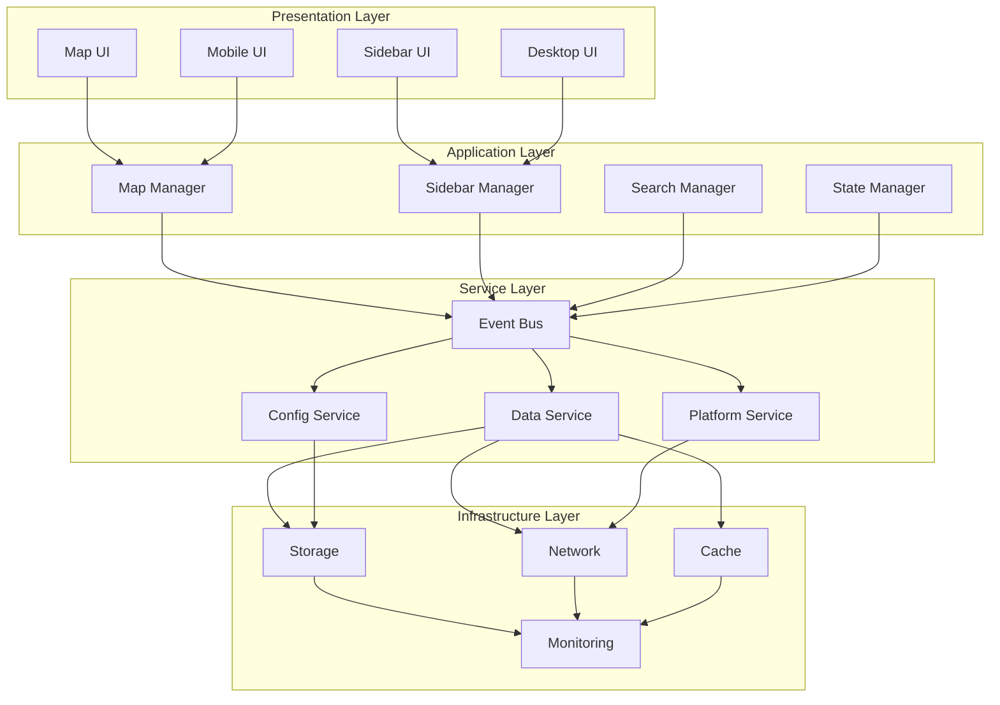

## Data Flow Patterns

### 1. Initialization Flow

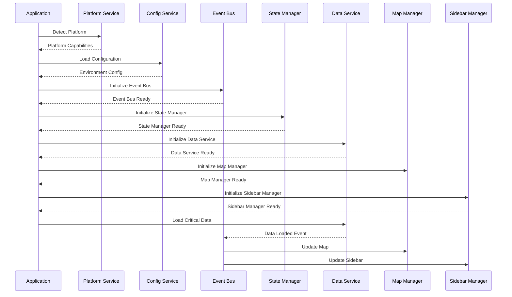

### 2. User Interaction Flow

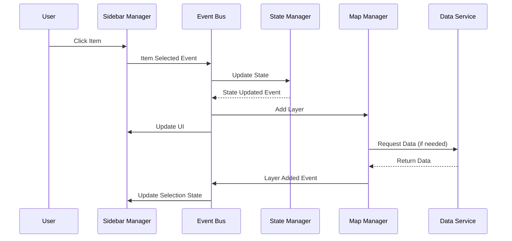

### 3. Error Handling Flow

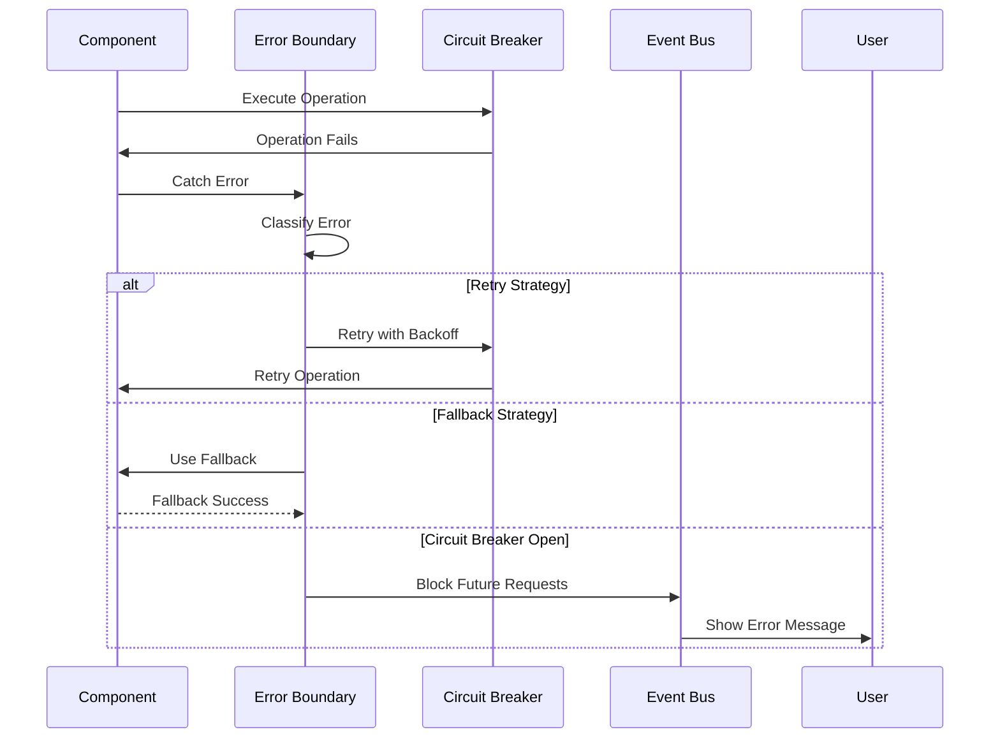

### 4. Data Loading Flow

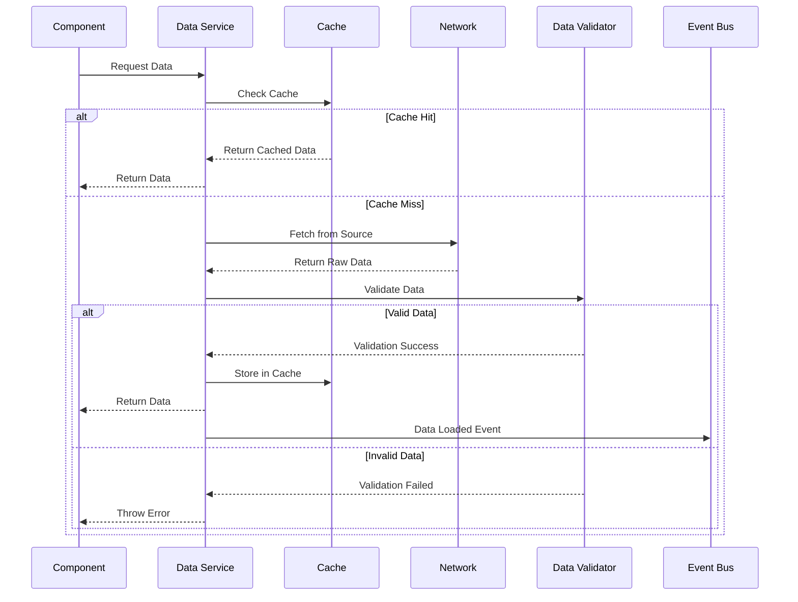

## State Management Flow

### 1. State Update Flow

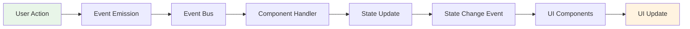

### 2. State Subscription Flow

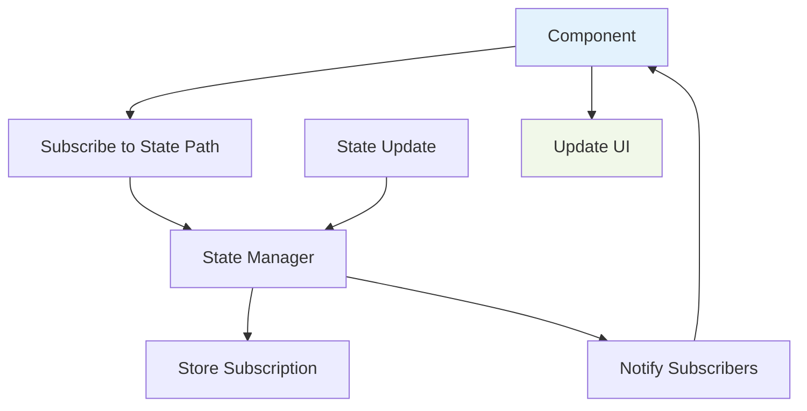

## Event System Flow

### 1. Event Processing Flow

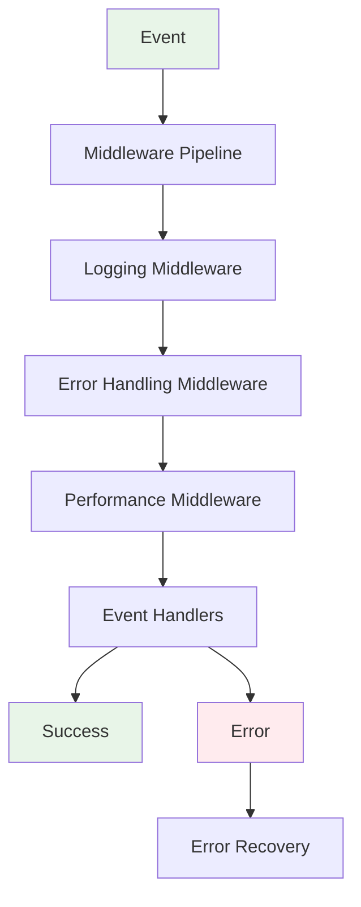

### 2. Event Middleware Flow

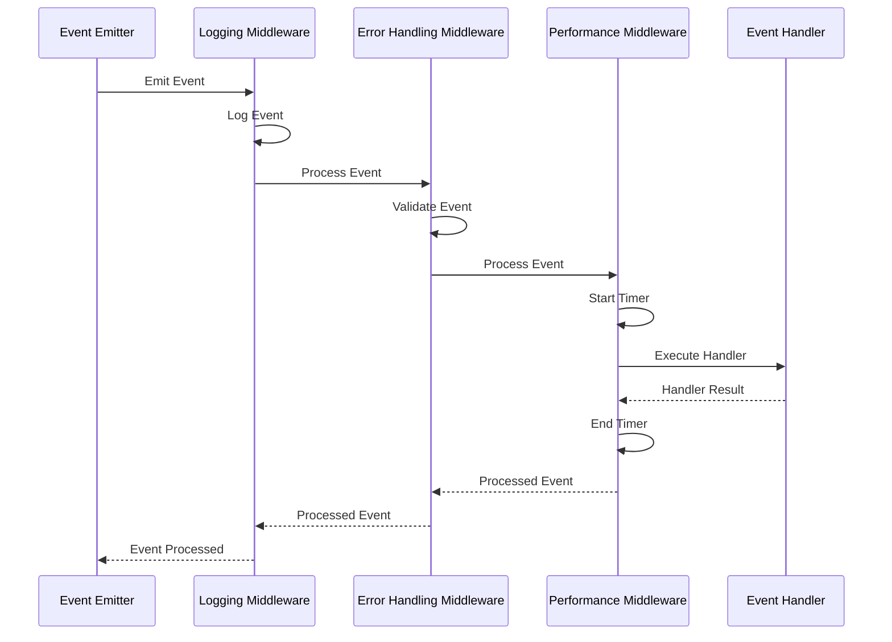

## Component Communication Flow

### 1. Map-Sidebar Communication

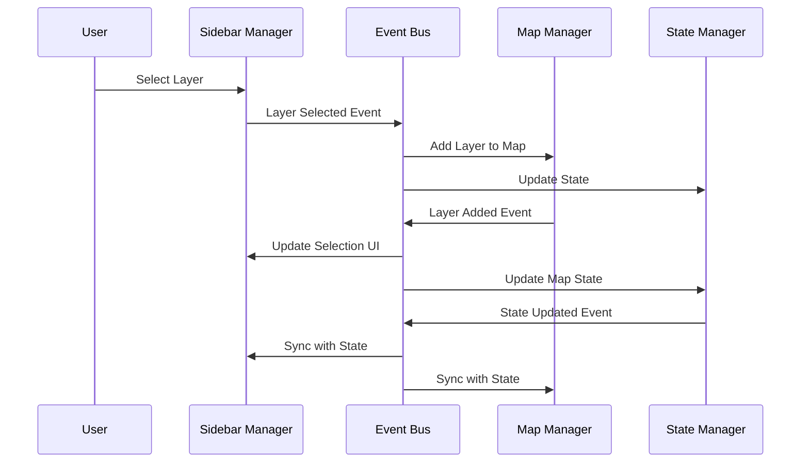

### 2. Search-Data Communication

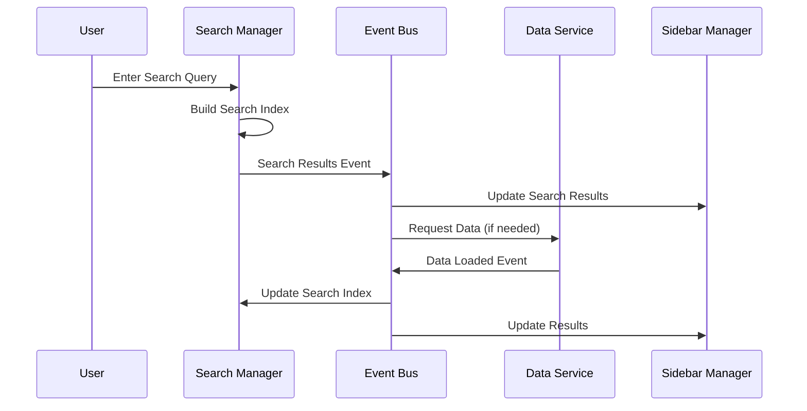

## Performance Optimization Flow

### 1. Data Virtualization Flow

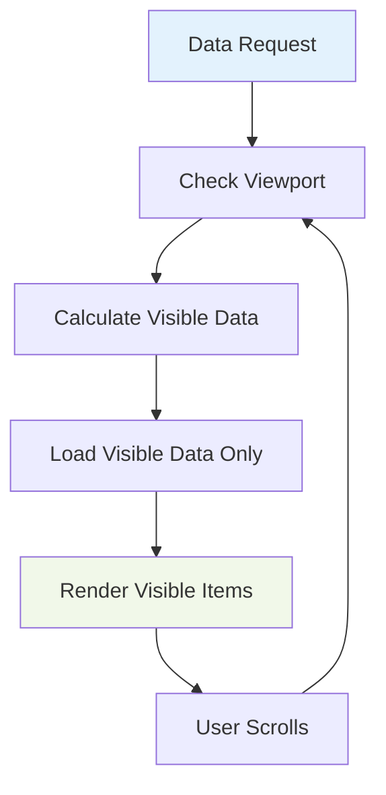

### 2. Lazy Loading Flow

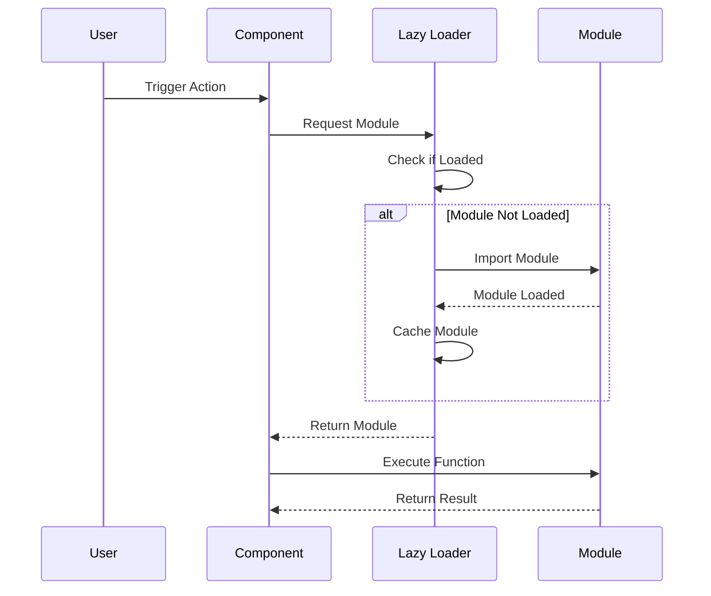

## Error Recovery Flow

### 1. Circuit Breaker Flow

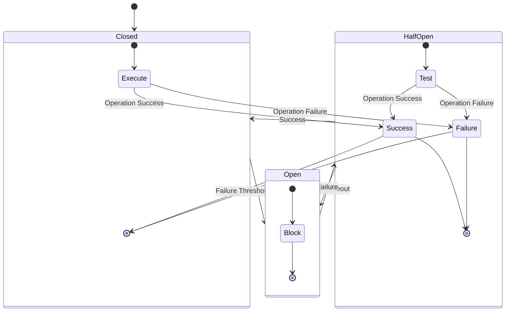

### 2. Retry Strategy Flow

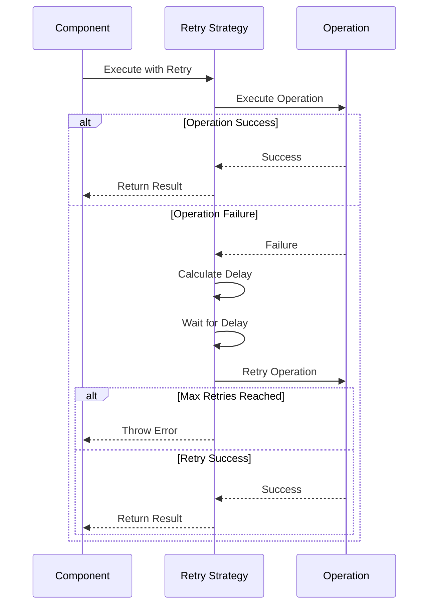

## Summary

These data flow diagrams illustrate:

1. **System Architecture**: Clear separation of concerns across layers
2. **Data Flow Patterns**: How data moves through the system
3. **Event Processing**: Event-driven communication patterns
4. **State Management**: Immutable state updates and subscriptions
5. **Component Communication**: Loose coupling via events
6. **Performance Optimization**: Virtualization and lazy loading
7. **Error Recovery**: Circuit breakers and retry strategies

The diagrams provide a visual representation of the refactored architecture, showing how the new system addresses the current fragility issues while providing a foundation for future growth and maintainability.
