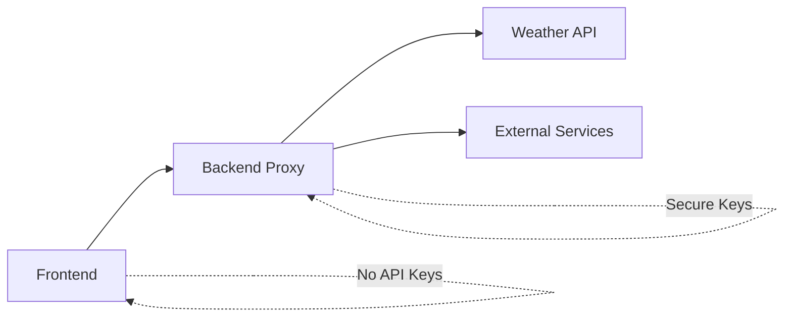

# Authentication & Security

> **Security model, access control, and production deployment guidelines**

## 📋 Overview

WeeWoo Map Friend implements a comprehensive security model designed for both development and production environments. The application follows security best practices for API key protection, input validation, and secure communication.

### **Security Principles**

| Principle | Implementation | Status |
|-----------|----------------|---------|
| **Defense in Depth** | Multiple security layers | ✅ Active |
| **Least Privilege** | Minimal required permissions | ✅ Active |
| **Secure by Default** | Safe default configurations | ✅ Active |
| **Input Validation** | All user inputs sanitized | ✅ Active |
| **API Key Protection** | Backend proxy pattern | ✅ Active |
| **HTTPS Enforcement** | Required for production | ✅ Active |

## 🔐 Authentication Model

### **Public Application Architecture**

WeeWoo Map Friend is designed as a **public application** with no user authentication required:

```javascript
// No authentication headers needed for frontend APIs
const loadEmergencyData = async () => {
  // Direct access to public GeoJSON data
  const response = await fetch('geojson/ambulance.geojson');
  const data = await response.json();
  return data;
};

// No API keys exposed in frontend code
const getWeatherData = async (lat, lon) => {
  // API keys handled by backend proxy
  const response = await fetch(`/api/weather?lat=${lat}&lon=${lon}`);
  return response.json();
};
```

### **Backend Authentication**

Backend services use **API key authentication** with secure proxy pattern:

```python
# Backend handles API key authentication
import os
from flask import Flask, request, jsonify

app = Flask(__name__)

# API keys stored securely in environment variables
WILLYWEATHER_API_KEY = os.getenv('WILLYWEATHER_API_KEY')

@app.route('/api/weather')
def get_weather():
    # Extract parameters from frontend request
    lat = request.args.get('lat')
    lon = request.args.get('lon')
    
    # Add API key for upstream service
    upstream_url = f"https://api.willyweather.com.au/weather?key={WILLYWEATHER_API_KEY}&lat={lat}&lon={lon}"
    
    # Proxy request with authentication
    response = requests.get(upstream_url)
    return jsonify(response.json())
```

## 🛡️ Security Implementation

### **API Key Protection**

**Problem**: Frontend applications cannot securely store API keys  
**Solution**: Backend proxy pattern



**Implementation**:

```javascript
// ✅ SECURE: Frontend makes request without API keys
const fetchWeather = async (lat, lon) => {
  const backendBase = (location.hostname === 'localhost')
    ? 'http://127.0.0.1:5000'
    : ''; // Production backend
  
  const response = await fetch(
    `${backendBase}/api/weather?lat=${lat}&lon=${lon}`
  );
  
  return response.json();
};

// ❌ INSECURE: Never do this in frontend
const fetchWeatherInsecure = async (lat, lon) => {
  const API_KEY = 'secret-key-123'; // ❌ Exposed to users
  
  const response = await fetch(
    `https://api.weather.com/data?key=${API_KEY}&lat=${lat}&lon=${lon}`
  );
  
  return response.json();
};
```

### **Input Validation & Sanitization**

All user inputs are validated and sanitized:

```javascript
/**
 * Validate and sanitize coordinate inputs
 */
const validateCoordinates = (lat, lon) => {
  // Type validation
  const latitude = parseFloat(lat);
  const longitude = parseFloat(lon);
  
  // Range validation
  if (isNaN(latitude) || latitude < -90 || latitude > 90) {
    throw new Error('Invalid latitude: must be between -90 and 90');
  }
  
  if (isNaN(longitude) || longitude < -180 || longitude > 180) {
    throw new Error('Invalid longitude: must be between -180 and 180');
  }
  
  return { latitude, longitude };
};

/**
 * Sanitize search input
 */
const sanitizeSearchInput = (input) => {
  if (!input || typeof input !== 'string') {
    return '';
  }
  
  // Remove potentially dangerous characters
  return input
    .replace(/[<>\"'&]/g, '') // Remove HTML/script injection chars
    .replace(/[^\w\s-]/g, '')  // Allow only alphanumeric, spaces, hyphens
    .trim()
    .substring(0, 100); // Limit length
};

/**\n * Example usage in search functionality\n */\nconst searchEmergencyServices = (query, category) => {\n  const sanitizedQuery = sanitizeSearchInput(query);\n  const sanitizedCategory = sanitizeSearchInput(category);\n  \n  if (!sanitizedQuery || !window.namesByCategory[sanitizedCategory]) {\n    return [];\n  }\n  \n  return window.namesByCategory[sanitizedCategory].filter(name =>\n    name.toLowerCase().includes(sanitizedQuery.toLowerCase())\n  );\n};\n```\n\n### **Content Security Policy (CSP)**\n\nRecommended CSP headers for production:\n\n```html\n<!-- Restrictive CSP for production -->\n<meta http-equiv=\"Content-Security-Policy\" content=\"\n  default-src 'self';\n  script-src 'self' 'unsafe-inline' \n    https://unpkg.com \n    https://cdn.jsdelivr.net;\n  style-src 'self' 'unsafe-inline' \n    https://unpkg.com;\n  img-src 'self' data: \n    https://*.tile.openstreetmap.org \n    https://*.tile.osm.org;\n  connect-src 'self' \n    https://nominatim.openstreetmap.org;\n  font-src 'self' data:;\n  object-src 'none';\n  base-uri 'self';\n  frame-ancestors 'none';\n\">\n```\n\n**CSP Configuration Explanation**:\n\n```javascript\nconst cspPolicies = {\n  'default-src': [\"'self'\"], // Only load resources from same origin\n  'script-src': [\n    \"'self'\",\n    \"'unsafe-inline'\", // Required for inline scripts (minimize in production)\n    \"https://unpkg.com\", // Leaflet CDN\n    \"https://cdn.jsdelivr.net\" // Turf.js CDN\n  ],\n  'style-src': [\n    \"'self'\",\n    \"'unsafe-inline'\", // Required for dynamic styles\n    \"https://unpkg.com\" // Leaflet CSS\n  ],\n  'img-src': [\n    \"'self'\",\n    \"data:\", // Base64 images\n    \"https://*.tile.openstreetmap.org\", // Map tiles\n    \"https://*.tile.osm.org\" // Alternative map tiles\n  ],\n  'connect-src': [\n    \"'self'\", // Backend API\n    \"https://nominatim.openstreetmap.org\" // Geocoding (if used)\n  ]\n};\n```\n\n### **HTTPS Enforcement**\n\nHTTPS is **required** for production deployment:\n\n```javascript\n/**\n * Enforce HTTPS in production\n */\nconst enforceHTTPS = () => {\n  // Redirect HTTP to HTTPS in production\n  if (location.protocol !== 'https:' && \n      location.hostname !== 'localhost' && \n      location.hostname !== '127.0.0.1') {\n    \n    console.warn('Redirecting to HTTPS for security');\n    location.replace(`https:${location.href.substring(location.protocol.length)}`);\n  }\n};\n\n/**\n * Check for secure context requirements\n */\nconst checkSecureContext = () => {\n  const isSecureContext = window.isSecureContext;\n  \n  if (!isSecureContext) {\n    console.warn('Not in secure context - some features may be limited');\n    \n    // Disable features that require secure context\n    const secureFeatures = {\n      geolocation: !('geolocation' in navigator),\n      serviceWorker: !('serviceWorker' in navigator),\n      pushNotifications: !('PushManager' in window)\n    };\n    \n    console.log('Secure context features:', secureFeatures);\n    \n    // Show user warning for non-HTTPS access\n    showSecurityWarning();\n  }\n};\n\nconst showSecurityWarning = () => {\n  const warningBanner = document.createElement('div');\n  warningBanner.className = 'security-warning';\n  warningBanner.innerHTML = `\n    <div class=\"warning-content\">\n      <span class=\"warning-icon\">⚠️</span>\n      <span class=\"warning-text\">Insecure connection detected. Some features may not work properly.</span>\n      <button class=\"warning-dismiss\" onclick=\"this.parentElement.parentElement.remove()\">×</button>\n    </div>\n  `;\n  \n  document.body.insertBefore(warningBanner, document.body.firstChild);\n};\n```\n\n## 🌐 CORS Configuration\n\n### **Backend CORS Policy**\n\n```python\n# Flask backend CORS configuration\nfrom flask_cors import CORS\nimport os\n\napp = Flask(__name__)\n\n# Configure CORS based on environment\nALLOWED_ORIGINS = os.getenv('ALLOWED_ORIGINS', 'http://localhost:8000,http://127.0.0.1:8000').split(',')\n\nCORS(app, \n     origins=ALLOWED_ORIGINS,\n     methods=['GET', 'POST', 'OPTIONS'],\n     allow_headers=['Content-Type', 'Authorization']\n)\n\n@app.before_request\ndef handle_preflight():\n    if request.method == \"OPTIONS\":\n        response = make_response()\n        response.headers.add(\"Access-Control-Allow-Origin\", \"*\")\n        response.headers.add('Access-Control-Allow-Headers', \"*\")\n        response.headers.add('Access-Control-Allow-Methods', \"*\")\n        return response\n```\n\n### **Environment-Specific CORS**\n\n```bash\n# Development .env\nALLOWED_ORIGINS=http://localhost:8000,http://127.0.0.1:8000,http://localhost:3000\n\n# Production .env\nALLOWED_ORIGINS=https://yourdomain.com,https://www.yourdomain.com\n```\n\n```javascript\n// Frontend CORS handling\nconst getBackendURL = () => {\n  const isDevelopment = location.hostname === 'localhost' || \n                       location.hostname === '127.0.0.1';\n  \n  if (isDevelopment) {\n    return 'http://127.0.0.1:5000';\n  }\n  \n  // Production: same-origin requests\n  return window.location.origin;\n};\n\nconst fetchWithCORS = async (endpoint, options = {}) => {\n  const backendURL = getBackendURL();\n  \n  const response = await fetch(`${backendURL}${endpoint}`, {\n    ...options,\n    headers: {\n      'Content-Type': 'application/json',\n      ...options.headers\n    },\n    // Include credentials for same-origin requests\n    credentials: backendURL === window.location.origin ? 'same-origin' : 'omit'\n  });\n  \n  if (!response.ok) {\n    throw new Error(`API request failed: ${response.status} ${response.statusText}`);\n  }\n  \n  return response;\n};\n```\n\n## 🔒 Production Security Checklist\n\n### **Deployment Security**\n\n```markdown\n## Pre-Deployment Security Checklist\n\n### ✅ API Security\n- [ ] API keys stored in environment variables (not code)\n- [ ] Backend proxy implemented for external APIs\n- [ ] Rate limiting configured on backend endpoints\n- [ ] Input validation implemented for all user inputs\n- [ ] Error messages don't expose sensitive information\n\n### ✅ Transport Security\n- [ ] HTTPS enforced for all production traffic\n- [ ] HTTP redirects to HTTPS configured\n- [ ] HSTS headers configured\n- [ ] Certificate is valid and properly configured\n\n### ✅ Content Security\n- [ ] Content Security Policy (CSP) headers configured\n- [ ] No inline scripts in production (prefer external files)\n- [ ] All external dependencies loaded over HTTPS\n- [ ] XSS protection headers enabled\n\n### ✅ Access Control\n- [ ] CORS properly configured for production domains\n- [ ] No debug endpoints exposed in production\n- [ ] Admin interfaces protected or removed\n- [ ] Proper error handling without information disclosure\n\n### ✅ Data Protection\n- [ ] No sensitive data logged in production\n- [ ] User input properly sanitized\n- [ ] No PII collected or stored\n- [ ] Cache headers configured appropriately\n\n### ✅ Infrastructure Security\n- [ ] Server security updates applied\n- [ ] Firewall configured to allow only necessary ports\n- [ ] Database access restricted (if applicable)\n- [ ] Monitoring and alerting configured\n```\n\n### **Security Headers**\n\nRecommended security headers for production:\n\n```nginx\n# Nginx configuration\nserver {\n    listen 443 ssl http2;\n    server_name yourdomain.com;\n    \n    # SSL configuration\n    ssl_certificate /path/to/certificate.crt;\n    ssl_certificate_key /path/to/private.key;\n    ssl_protocols TLSv1.2 TLSv1.3;\n    ssl_ciphers HIGH:!aNULL:!MD5;\n    \n    # Security headers\n    add_header Strict-Transport-Security \"max-age=31536000; includeSubDomains\" always;\n    add_header X-Frame-Options \"SAMEORIGIN\" always;\n    add_header X-Content-Type-Options \"nosniff\" always;\n    add_header Referrer-Policy \"strict-origin-when-cross-origin\" always;\n    add_header Permissions-Policy \"geolocation=(self), microphone=(), camera=()\" always;\n    \n    # CSP header (adjust based on your needs)\n    add_header Content-Security-Policy \"default-src 'self'; script-src 'self' 'unsafe-inline' https://unpkg.com https://cdn.jsdelivr.net; style-src 'self' 'unsafe-inline' https://unpkg.com; img-src 'self' data: https://*.tile.openstreetmap.org; connect-src 'self';\" always;\n    \n    location / {\n        root /var/www/weewoo-map;\n        index index.html;\n        try_files $uri $uri/ /index.html;\n    }\n    \n    location /api/ {\n        proxy_pass http://127.0.0.1:5000;\n        proxy_set_header Host $host;\n        proxy_set_header X-Real-IP $remote_addr;\n        proxy_set_header X-Forwarded-For $proxy_add_x_forwarded_for;\n        proxy_set_header X-Forwarded-Proto $scheme;\n    }\n}\n\n# Redirect HTTP to HTTPS\nserver {\n    listen 80;\n    server_name yourdomain.com;\n    return 301 https://$server_name$request_uri;\n}\n```\n\n## 🛠️ Development Security\n\n### **Local Development Setup**\n\n```bash\n# Secure local development environment\n\n# 1. Create backend environment file\ncp backend/.env.example backend/.env\n\n# 2. Add your API keys (never commit these)\necho \"WILLYWEATHER_API_KEY=your_dev_key_here\" >> backend/.env\necho \"USE_MOCK=1\" >> backend/.env  # Use mock data for most development\n\n# 3. Set development CORS origins\necho \"ALLOWED_ORIGINS=http://localhost:8000,http://127.0.0.1:8000\" >> backend/.env\n\n# 4. Secure the .env file\nchmod 600 backend/.env\n\n# 5. Add .env to .gitignore (if not already present)\necho \"backend/.env\" >> .gitignore\n```\n\n### **API Key Management**\n\n```javascript\n/**\n * Development configuration with security\n */\nconst Config = {\n  // ✅ SECURE: Environment-based configuration\n  getBackendURL() {\n    const isDev = process.env.NODE_ENV === 'development' || \n                  location.hostname === 'localhost';\n    \n    return isDev \n      ? 'http://127.0.0.1:5000'\n      : window.location.origin;\n  },\n  \n  // ✅ SECURE: No API keys in frontend code\n  isUsingMockData() {\n    // Determined by backend, not frontend\n    return this.isDevelopment();\n  },\n  \n  isDevelopment() {\n    return location.hostname === 'localhost' || \n           location.hostname === '127.0.0.1';\n  }\n};\n\n// ❌ INSECURE: Never do this\nconst BadConfig = {\n  API_KEYS: {\n    WILLYWEATHER: 'secret-key-123', // ❌ Exposed to users\n    OPENWEATHER: 'another-secret'   // ❌ Visible in source code\n  }\n};\n```\n\n## 🔍 Security Monitoring\n\n### **Error Logging**\n\n```javascript\n/**\n * Secure error logging\n */\nconst SecurityLogger = {\n  // Log security events without exposing sensitive data\n  logSecurityEvent(event, details = {}) {\n    const logData = {\n      timestamp: new Date().toISOString(),\n      event,\n      userAgent: navigator.userAgent,\n      url: window.location.href,\n      // Filter sensitive data\n      details: this.sanitizeLogData(details)\n    };\n    \n    // In production, send to monitoring service\n    if (!Config.isDevelopment()) {\n      this.sendToMonitoring(logData);\n    } else {\n      console.warn('Security Event:', logData);\n    }\n  },\n  \n  sanitizeLogData(data) {\n    const sanitized = { ...data };\n    \n    // Remove sensitive fields\n    const sensitiveFields = ['password', 'token', 'key', 'secret'];\n    sensitiveFields.forEach(field => {\n      if (sanitized[field]) {\n        sanitized[field] = '[REDACTED]';\n      }\n    });\n    \n    return sanitized;\n  },\n  \n  async sendToMonitoring(data) {\n    try {\n      await fetch('/api/security-log', {\n        method: 'POST',\n        headers: { 'Content-Type': 'application/json' },\n        body: JSON.stringify(data)\n      });\n    } catch (error) {\n      console.error('Failed to send security log:', error);\n    }\n  }\n};\n\n// Usage examples\nSecurityLogger.logSecurityEvent('input_validation_failed', {\n  input: 'user input that failed validation',\n  reason: 'invalid_coordinates'\n});\n\nSecurityLogger.logSecurityEvent('api_request_failed', {\n  endpoint: '/api/weather',\n  status: 403,\n  reason: 'rate_limit_exceeded'\n});\n```\n\n## 🔗 Related Documentation\n\n- **[API Overview](README.md)** - Complete API reference\n- **[Rate Limits](rate-limits.md)** - Performance and security constraints\n- **[Error Handling](error-handling.md)** - Secure error management\n- **[Deployment Guide](../development/deployment.md)** - Production deployment security\n\n---\n\n**Next**: Learn about [rate limits and performance constraints](rate-limits.md) for optimal security and performance.