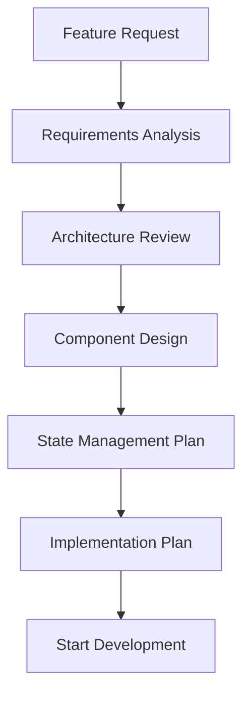
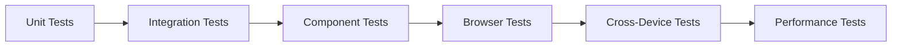

# Development Workflows

## Overview

This document defines the standardized development processes, workflows, and best practices for the WeeWoo Map Friend project. These workflows ensure consistent code quality, efficient collaboration, and maintainable architecture across all development activities.

## Development Philosophy

### **Core Principles**

- **Component-Based Development**: All UI elements follow the ComponentBase pattern
- **State Management First**: Design state structure before implementing UI
- **Progressive Enhancement**: Core functionality works everywhere, enhanced features on capable devices
- **Mobile-First Design**: Responsive design with 4-tier breakpoint system
- **Performance by Default**: Optimize for speed and responsiveness from the start

### **Quality Standards**

- **Code Consistency**: Follow established patterns and naming conventions
- **Error Handling**: Implement proper error boundaries and user feedback
- **Accessibility**: Ensure all features work with assistive technologies
- **Testing**: Validate functionality across devices and browsers
- **Documentation**: Document all public APIs and complex logic

## Development Environment Setup

### **1. Prerequisites**

#### **Required Software**

```bash
# Node.js (LTS version)
node --version  # Should be 18.x or higher

# Git
git --version   # Should be 2.x or higher

# Code Editor (VS Code recommended)
# - Install Cursor or VS Code
# - Install recommended extensions for JavaScript/HTML/CSS
```

#### **Browser Requirements**

- **Chrome/Edge**: Latest version for development
- **Firefox**: Latest version for testing
- **Safari**: Latest version for testing
- **Mobile Browsers**: Chrome Mobile, Safari Mobile

### **2. Project Setup**

#### **Initial Clone & Setup**

```bash
# Clone the repository
git clone https://github.com/yourusername/mapexp.github.io.git
cd mapexp.github.io

# Install dependencies (if any)
npm install

# Start development server
# For this project, use a local server due to CORS requirements
npx http-server . -p 8080 -c-1
# Or use Live Server extension in VS Code
```

#### **Development Server Configuration**

```javascript
// Recommended development server setup
const devServer = {
  port: 8080,
  cors: true,
  open: true,
  watch: true,
  // Enable source maps for debugging
  sourceMap: true,
};
```

### **3. Development Tools**

#### **VS Code Extensions**

```json
{
  "recommendations": [
    "ms-vscode.vscode-typescript-next",
    "bradlc.vscode-tailwindcss",
    "esbenp.prettier-vscode",
    "ms-vscode.vscode-json",
    "ms-vscode.vscode-css-peek",
    "formulahendry.auto-rename-tag"
  ]
}
```

#### **Browser DevTools Setup**

- **Chrome DevTools**: Enable source maps, performance monitoring
- **Firefox DevTools**: Enable source maps, responsive design mode
- **Mobile Testing**: Use device emulation and responsive design tools

## Development Workflows

### **1. Feature Development Workflow**

#### **Feature Planning Phase**



#### **Implementation Steps**

1. **Component Analysis**: Determine if new component needed or existing can be extended
2. **State Planning**: Design state structure and data flow
3. **Component Creation**: Follow ComponentBase patterns
4. **Integration**: Integrate with existing components and state
5. **Testing**: Test across devices and browsers
6. **Documentation**: Update relevant documentation

#### **Component Development Template**

```javascript
// 1. Create component file
// js/components/NewFeature.js
class NewFeature extends window.ComponentBase {
  constructor(container, options = {}) {
    super(container, {
      autoInit: false,
      ...options,
    });

    this.state = {
      // Define initial state
      isVisible: false,
      data: null,
      loading: false,
    };
  }

  // 2. Implement lifecycle methods
  async beforeInit() {
    // Load dependencies, validate configuration
  }

  async render() {
    // Create DOM structure
  }

  attachEvents() {
    // Bind event listeners
  }

  async afterInit() {
    // Final setup, external integrations
  }

  // 3. Implement feature logic
  async loadData() {
    // Data loading implementation
  }

  // 4. Implement cleanup
  destroy() {
    // Clean up resources
    super.destroy();
  }
}

// 5. Register component
window.ComponentRegistry.register('newFeature', NewFeature);
```

### **2. Bug Fix Workflow**

#### **Bug Reporting Template**

```markdown
## Bug Report

**Description**: Brief description of the issue
**Steps to Reproduce**:

1. Step 1
2. Step 2
3. Step 3

**Expected Behavior**: What should happen
**Actual Behavior**: What actually happens
**Environment**: Browser, OS, device
**Severity**: Critical/High/Medium/Low
**Priority**: P1/P2/P3/P4

**Additional Context**: Screenshots, console logs, etc.
```

#### **Bug Fix Process**

1. **Reproduce**: Confirm the bug exists and can be reproduced
2. **Investigate**: Identify root cause and affected components
3. **Plan Fix**: Design solution that doesn't introduce new issues
4. **Implement**: Make minimal changes to fix the issue
5. **Test**: Verify fix works and doesn't break other functionality
6. **Document**: Update documentation if needed

#### **Bug Fix Checklist**

- [ ] Bug is reproducible
- [ ] Root cause identified
- [ ] Fix implemented with minimal changes
- [ ] Fix tested on affected devices/browsers
- [ ] Fix doesn't break existing functionality
- [ ] Documentation updated if needed
- [ ] Code review completed

### **3. Code Review Workflow**

#### **Pull Request Template**

```markdown
## Pull Request

**Type**: Feature/Bug Fix/Refactor/Documentation
**Description**: Brief description of changes
**Related Issues**: Links to related issues

**Changes Made**:

- [ ] Change 1
- [ ] Change 2
- [ ] Change 3

**Testing**:

- [ ] Tested on desktop browsers
- [ ] Tested on mobile devices
- [ ] Tested with different screen sizes
- [ ] No console errors
- [ ] Performance impact assessed

**Documentation**:

- [ ] Code comments added
- [ ] README updated if needed
- [ ] API documentation updated if needed

**Breaking Changes**: None/List any breaking changes
```

#### **Code Review Checklist**

- [ ] **Functionality**: Does the code work as intended?
- [ ] **Architecture**: Does it follow established patterns?
- [ ] **Performance**: Any performance implications?
- [ ] **Security**: Any security concerns?
- [ ] **Accessibility**: Accessible to all users?
- [ ] **Testing**: Adequate test coverage?
- [ ] **Documentation**: Code is self-documenting?

#### **Review Process**

1. **Self-Review**: Author reviews their own code first
2. **Peer Review**: At least one peer reviews the code
3. **Architecture Review**: Complex changes get architecture review
4. **Final Approval**: Maintainer gives final approval
5. **Merge**: Code is merged to main branch

### **4. Testing Workflow**

#### **Testing Strategy**



#### **Testing Levels**

##### **Unit Testing**

```javascript
// Test individual functions and methods
describe('ComponentBase', () => {
  test('should initialize with correct state', () => {
    const component = new TestComponent(container);
    expect(component.state.isVisible).toBe(false);
  });

  test('should emit events correctly', () => {
    const component = new TestComponent(container);
    const mockHandler = jest.fn();
    component.on('test:event', mockHandler);
    component.emit('test:event', { data: 'test' });
    expect(mockHandler).toHaveBeenCalledWith({ data: 'test' });
  });
});
```

##### **Integration Testing**

```javascript
// Test component interactions
describe('Component Integration', () => {
  test('should communicate via EventBus', () => {
    const componentA = new ComponentA(containerA);
    const componentB = new ComponentB(containerB);

    componentB.on('data:ready', mockHandler);
    componentA.emit('data:ready', { data: 'test' });

    expect(mockHandler).toHaveBeenCalled();
  });
});
```

##### **Browser Testing**

```javascript
// Test in actual browser environment
describe('Browser Integration', () => {
  test('should work with DOM APIs', async () => {
    const component = new DOMComponent(container);
    await component.init();

    expect(container.querySelector('.component')).toBeTruthy();
  });
});
```

#### **Testing Checklist**

- [ ] **Unit Tests**: All new functions have unit tests
- [ ] **Integration Tests**: Component interactions tested
- [ ] **Browser Tests**: Works in target browsers
- [ ] **Mobile Tests**: Works on mobile devices
- [ ] **Performance Tests**: No performance regressions
- [ **Accessibility Tests**: Meets accessibility standards

### **5. Performance Optimization Workflow**

#### **Performance Monitoring**

```javascript
// Performance measurement utilities
class PerformanceMonitor {
  static measure(name, fn) {
    const start = performance.now();
    const result = fn();
    const end = performance.now();

    console.log(`${name} took ${end - start}ms`);
    return result;
  }

  static measureAsync(name, asyncFn) {
    const start = performance.now();
    return asyncFn().then((result) => {
      const end = performance.now();
      console.log(`${name} took ${end - start}ms`);
      return result;
    });
  }
}

// Usage
PerformanceMonitor.measure('Component Render', () => {
  component.render();
});
```

#### **Performance Optimization Process**

1. **Baseline Measurement**: Measure current performance
2. **Identify Bottlenecks**: Find performance issues
3. **Optimize**: Implement performance improvements
4. **Measure Again**: Verify improvements
5. **Document**: Document optimization techniques

#### **Common Optimizations**

```javascript
// 1. Debounced updates
class OptimizedComponent extends window.ComponentBase {
  constructor(container, options = {}) {
    super(container, options);
    this._updateTimeout = null;
  }

  async update(newState) {
    if (this._updateTimeout) {
      clearTimeout(this._updateTimeout);
    }

    this._updateTimeout = setTimeout(async () => {
      await super.update(newState);
      this._updateTimeout = null;
    }, 100);
  }
}

// 2. Lazy loading
class LazyComponent extends window.ComponentBase {
  constructor(container, options = {}) {
    super(container, { autoInit: false, ...options });
  }

  async initializeWhenVisible() {
    if (this.isElementVisible()) {
      await this.init();
    }
  }
}

// 3. Batch operations
class BatchComponent extends window.ComponentBase {
  constructor(container, options = {}) {
    super(container, options);
    this._pendingUpdates = [];
    this._batchTimeout = null;
  }

  queueUpdate(update) {
    this._pendingUpdates.push(update);

    if (this._batchTimeout) {
      clearTimeout(this._batchTimeout);
    }

    this._batchTimeout = setTimeout(() => {
      this.processBatchUpdates();
    }, 16); // One frame
  }

  async processBatchUpdates() {
    const updates = [...this._pendingUpdates];
    this._pendingUpdates = [];

    // Process all updates at once
    const mergedUpdate = updates.reduce((acc, update) => ({ ...acc, ...update }), {});
    await this.update(mergedUpdate);
  }
}
```

## Code Quality Standards

### **1. JavaScript Standards**

#### **ES6+ Features**

```javascript
// Use modern JavaScript features
// ✅ Good
const { name, value } = options;
const names = [...existingNames, newName];
const filtered = items.filter((item) => item.active);

// ❌ Avoid
var name = options.name;
var names = existingNames.concat([newName]);
var filtered = [];
for (var i = 0; i < items.length; i++) {
  if (items[i].active) {
    filtered.push(items[i]);
  }
}
```

#### **Component Patterns**

```javascript
// ✅ Good - Follow ComponentBase patterns
class MyComponent extends window.ComponentBase {
  constructor(container, options = {}) {
    super(container, options);
  }

  async render() {
    // Implementation
  }

  attachEvents() {
    // Implementation
  }
}

// ❌ Avoid - Don't bypass ComponentBase
class MyComponent {
  constructor(container) {
    this.container = container;
    // Missing lifecycle management
  }
}
```

#### **Error Handling**

```javascript
// ✅ Good - Proper error handling
async loadData() {
  try {
    const response = await fetch('/api/data');
    if (!response.ok) {
      throw new Error(`HTTP ${response.status}: ${response.statusText}`);
    }
    return await response.json();
  } catch (error) {
    console.error('Failed to load data:', error);
    this.emit('error:dataLoad', { error });
    throw error;
  }
}

// ❌ Avoid - No error handling
async loadData() {
  const response = await fetch('/api/data');
  return response.json();
}
```

### **2. CSS Standards**

#### **CSS Custom Properties**

```css
/* ✅ Good - Use CSS custom properties */
:root {
  --primary-color: #007bff;
  --secondary-color: #6c757d;
  --border-radius: 4px;
  --transition-duration: 0.2s;
}

.button {
  background-color: var(--primary-color);
  border-radius: var(--border-radius);
  transition: all var(--transition-duration) ease;
}

/* ❌ Avoid - Hard-coded values */
.button {
  background-color: #007bff;
  border-radius: 4px;
  transition: all 0.2s ease;
}
```

#### **Responsive Design**

```css
/* ✅ Good - Mobile-first responsive design */
.component {
  padding: 1rem;
  font-size: 1rem;
}

@media (min-width: 768px) {
  .component {
    padding: 1.5rem;
    font-size: 1.1rem;
  }
}

@media (min-width: 1024px) {
  .component {
    padding: 2rem;
    font-size: 1.2rem;
  }
}

/* ❌ Avoid - Desktop-first approach */
.component {
  padding: 2rem;
  font-size: 1.2rem;
}

@media (max-width: 1023px) {
  .component {
    padding: 1.5rem;
    font-size: 1.1rem;
  }
}

@media (max-width: 767px) {
  .component {
    padding: 1rem;
    font-size: 1rem;
  }
}
```

### **3. HTML Standards**

#### **Semantic HTML**

```html
<!-- ✅ Good - Semantic HTML -->
<main class="map-container">
  <section class="sidebar" aria-label="Layer controls">
    <header class="sidebar-header">
      <h2>Map Layers</h2>
    </header>
    <nav class="layer-navigation" role="navigation">
      <!-- Navigation content -->
    </nav>
  </section>

  <section class="map-view" aria-label="Map display">
    <div id="map" role="application" aria-label="Interactive map"></div>
  </section>
</main>

<!-- ❌ Avoid - Non-semantic HTML -->
<div class="map-container">
  <div class="sidebar">
    <div class="sidebar-header">
      <div class="title">Map Layers</div>
    </div>
    <div class="layer-navigation">
      <!-- Navigation content -->
    </div>
  </div>

  <div class="map-view">
    <div id="map"></div>
  </div>
</div>
```

#### **Accessibility**

```html
<!-- ✅ Good - Accessible HTML -->
<button
  class="fab-button"
  aria-label="Toggle sidebar"
  aria-controls="layerMenu"
  aria-expanded="true"
  title="Hide panel"
>
  ☰
</button>

<div id="layerMenu" aria-hidden="false">
  <!-- Sidebar content -->
</div>

<!-- ❌ Avoid - Missing accessibility attributes -->
<button class="fab-button">☰</button>
<div id="layerMenu">
  <!-- Sidebar content -->
</div>
```

## Deployment Workflow

### **1. Pre-Deployment Checklist**

#### **Code Quality**

- [ ] All tests pass
- [ ] Code review completed
- [ ] No console errors
- [ ] Performance benchmarks met
- [ ] Accessibility standards met

#### **Functionality**

- [ ] Core features work
- [ ] Mobile functionality tested
- [ ] Cross-browser compatibility verified
- [ ] Error handling tested
- [ ] Offline functionality tested

#### **Documentation**

- [ ] README updated
- [ ] API documentation current
- [ ] Change log updated
- [ ] Deployment notes added

### **2. Deployment Process**

#### **Staging Deployment**

```bash
# 1. Create staging branch
git checkout -b staging/v1.2.0

# 2. Test in staging environment
npm run test:staging

# 3. Verify functionality
# Test on multiple devices and browsers

# 4. Get approval for production
```

#### **Production Deployment**

```bash
# 1. Merge to main branch
git checkout main
git merge staging/v1.2.0

# 2. Create release tag
git tag -a v1.2.0 -m "Release version 1.2.0"
git push origin v1.2.0

# 3. Deploy to production
# (Depends on hosting platform)

# 4. Verify production deployment
# Test production environment
```

### **3. Post-Deployment**

#### **Monitoring**

- Monitor error rates
- Check performance metrics
- Verify functionality
- Monitor user feedback

#### **Rollback Plan**

```bash
# If issues are found, rollback to previous version
git checkout v1.1.0
git checkout -b hotfix/rollback-v1.2.0
git push origin hotfix/rollback-v1.2.0

# Deploy rollback version
```

## Troubleshooting & Debugging

### **1. Common Issues**

#### **Component Not Initializing**

```javascript
// Debug component initialization
const component = new MyComponent(container, {
  enableLogging: true,
  debug: true,
});

// Check console for initialization logs
component.on('component:initialized', () => {
  console.log('Component initialized successfully');
});

component.on('component:error', (error) => {
  console.error('Component initialization failed:', error);
});
```

#### **State Not Updating**

```javascript
// Debug state updates
component.on('component:stateChange', (data) => {
  console.log('State changed:', data);
});

// Check state manually
console.log('Current state:', component.state);
console.log('State history:', component._stateHistory);
```

#### **Events Not Working**

```javascript
// Debug event system
component.on('*', (event, data) => {
  console.log(`Event received: ${event}`, data);
});

// Check event listeners
console.log('Active listeners:', component._listeners);
```

### **2. Debugging Tools**

#### **Component Inspector**

```javascript
// Add to ComponentBase for debugging
class ComponentBase extends EventBus {
  // ... existing code ...

  inspect() {
    return {
      id: this.id,
      state: this.state,
      options: this.options,
      container: this.container,
      listeners: this._listeners,
      isInitialized: this._initialized,
      isDestroyed: this._destroyed,
    };
  }

  logState() {
    console.log(`Component ${this.id} state:`, this.state);
  }

  logListeners() {
    console.log(`Component ${this.id} listeners:`, this._listeners);
  }
}
```

#### **Performance Profiling**

```javascript
// Performance profiling utilities
class PerformanceProfiler {
  static profile(name, fn) {
    const start = performance.now();
    const startMemory = performance.memory?.usedJSHeapSize;

    const result = fn();

    const end = performance.now();
    const endMemory = performance.memory?.usedJSHeapSize;

    console.log(`${name}:`, {
      duration: `${end - start}ms`,
      memoryDelta:
        startMemory && endMemory ? `${Math.round((endMemory - startMemory) / 1024)}KB` : 'N/A',
    });

    return result;
  }
}
```

## Best Practices Summary

### **1. Development**

- Follow ComponentBase patterns consistently
- Use modern JavaScript features
- Implement proper error handling
- Write self-documenting code
- Test across multiple devices

### **2. Performance**

- Optimize for mobile devices
- Use lazy loading where appropriate
- Implement proper caching strategies
- Monitor performance metrics
- Profile performance regularly

### **3. Quality**

- Write comprehensive tests
- Follow accessibility guidelines
- Implement proper error boundaries
- Document all public APIs
- Review code thoroughly

### **4. Collaboration**

- Use consistent coding standards
- Document architectural decisions
- Share knowledge with team
- Review each other's code
- Maintain clear communication

## Related Documentation

- **[Architecture Overview](../architecture/overview.md)** - System architecture and design
- **[Component Architecture](../architecture/components.md)** - Component patterns and lifecycle
- **[Data Flow & State Management](../architecture/data-flow.md)** - State management patterns
- **[Development Setup](setup.md)** - Development environment setup
- **[Testing Framework](../templates/testing-template.md)** - Testing procedures
- **[Performance Baselines](../templates/performance-baselines.md)** - Performance measurement

## Quick Reference

### **Essential Commands**

```bash
# Development
npm run dev          # Start development server
npm run test         # Run tests
npm run build        # Build for production
npm run lint         # Run linting

# Git workflow
git checkout -b feature/new-feature    # Create feature branch
git add .                              # Stage changes
git commit -m "feat: add new feature"  # Commit changes
git push origin feature/new-feature    # Push to remote
```

### **Component Template**

```javascript
class MyComponent extends window.ComponentBase {
  constructor(container, options = {}) {
    super(container, options);
  }

  async render() {
    // Implement DOM rendering
  }

  attachEvents() {
    // Implement event binding
  }

  async onStateChange(oldState, newState) {
    // Handle state changes
  }
}
```

### **Testing Template**

```javascript
describe('MyComponent', () => {
  test('should initialize correctly', () => {
    const component = new MyComponent(container);
    expect(component.state).toBeDefined();
  });

  test('should render DOM structure', async () => {
    const component = new MyComponent(container);
    await component.init();
    expect(container.querySelector('.my-component')).toBeTruthy();
  });
});
```

---

_This development workflow provides the foundation for consistent, high-quality development practices. Follow these patterns to ensure maintainable, extensible, and performant code across the entire application._
